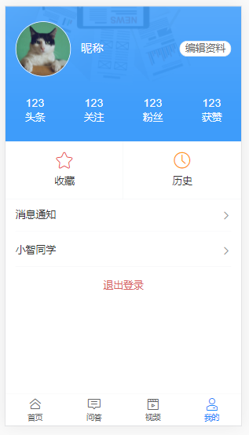
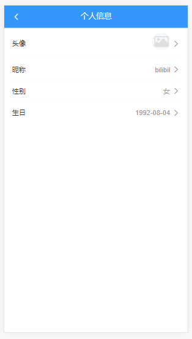
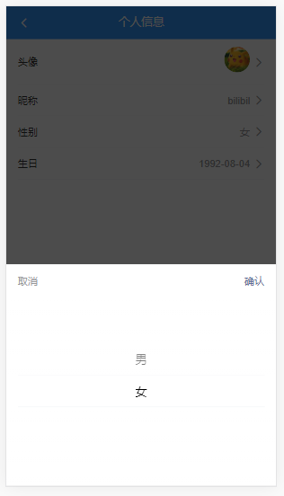

# 黑马头条移动端

## 1.创建项目

```创建项目
vue create 项目名
```

## 2.加入 git 管理

```git 
// 添加远程仓库
git remote add origin 远程仓库地址
// 检查远程仓库是否添加成功
git remote -v
// 第一次提交
git push -u origin master
// 查看状态
git status
// 三部曲
git add .
git commit -m'项目操作步骤'
git push
```

## 3.移动端 rem 布局适配

1. [lib-flexible](https://github.com/amfe/lib-flexible) 用于自动设置 rem 基准值（即 html 标签字体大小）

   ```git
   // 安装
   npm i -S amfe-flexible
   ```

   ```main.js
   // 导入
   import 'amfe-flexible'
   ```

   查看

   

2. [postcss-pxtorem](https://github.com/cuth/postcss-pxtorem) 是一款 postcss 插件，用于将单位 px 转化为 rem

   ```git
   // 安装
   // -D 是 --save-dev 的简写
   npm install postcss-pxtorem --save-dev
   ```

   然后再**项目根目录**中创建文件 `postcss.config.js`文件

   ```postcss.config.js
   module.exports = {
     plugins: {
       autoprefixer: {
         browsers: ['Android >= 4.0', 'iOS >= 8']
       },
       'postcss-pxtorem': {
         rootValue: 37.5,
         propList: ['*']
       }
     }
   }
   ```

   配置完毕，重启服务，最后测试：审查元素样式是否已将 px 转换为 rem 

   

   

   ```postcss.config.js
       // 自动添加浏览器厂商声明前缀，用来兼容不同的浏览器
       // VueCLI 已经在内部默认配置了 autoprefixer
       // autoprefixer: {
       //   // browsers 用来配置要兼容到的系统(浏览器)环境
       //   // 这个配置没有问题，但是写到这里会有控制台编译警告
       //   // 为什么？因为 VueCLI 是通过项目中的 .browserslistrc 文件来配置要兼容的环境信息的
       //   browsers: ['Android >= 4.0', 'iOS >= 8']
       // },
   ```

   ```.browserslistrc
   # browserslist 配置参考：https://github.com/browserslist/browserslist
   # 这个值会被 @babel/preset-env 和 Autoprefixer 用来确定需要转译的 JavaScript 特性和需要添加的 CSS 浏览器前缀。
   
   # 兼容到超过百分之1的用户使用的浏览器
   # > 1%
   
   # 兼容到最后的两个版本
   # last 2 versions
   
   # not dead
   
   Android >= 4.0
   iOS >= 8
   ```

## 4.导入字体图标

思路：在 styles 文件下新建 icon.less ，然后把在 [Iconfont](https://www.iconfont.cn/home/index?spm=a313x.7781069.1998910419.2) 生成的字体图标代码复制粘贴到该文件下，并且将该文件导入到 styles 文件下的 index.less ，最后测试字体图标是否导入成功

```icon.less
@font-face {font-family: "toutiao";
    src: url('//at.alicdn.com/t/font_1807762_mwbzdo1z7h.eot?t=1589005330376'); /* IE9 */
    src: url('//at.alicdn.com/t/font_1807762_mwbzdo1z7h.eot?t=1589005330376#iefix') format('embedded-opentype'), /* IE6-IE8 */
    url('data:application/x-font-woff2;charset=utf-8;base64,d09GMgABAAAAAA6gAAsAAAAAGWQAAA5RAAEAAAAAAAAAAAAAAAAAAAAAAAAAAAAAHEIGVgCFCAqiOJsEATYCJANUCywABCAFhGEHgWsbvRQzo/aKtHIj+68TOLk/rA4NzelemIqYKGADNS3cBGGZYhXxhGFPRtxiOcj/rMxFmDLdaH9NISjU45jgn28u/Psyk2wyCe9uiVhVlVVrERXj8RWuFaZCEZGj/zcA5p/f5t/Ho+phg39gJlYiFjqMKDARMzB6WeiqylzDIpIDXwfntLOpDY3grK8cojpLoMQudgxJ818hOeC+29+0v7GNQqguefYvPz2FMPpo0gdJxw3aVcMmWd4DqGAFJ7BNWp2weFdQZczMGu5oHkEWcdsrkFAAfo+3rwcIHBz/31pqM3mP1V2EG3HkAt7s7O1P9h//8oR4L4XZAKsiqb4aWaFmirvlILnUpY5khatwtrIQYE71SY0LJHGAFNVhm9ttv3V1CHB0YRCa9RkZD0IsKiOmrY5FOSDcOI3NREVYCBIftU6n8Am9w947nIx/Xp9HKAQP36C+Zs7S4Hww7d27htnVYotNJ9q5nATKT4EBBgEWtC3ZsRWzwEEx61Idltn5jGXeu0arBd7h07W18XsYLP77UmuERDhiElIycgpKKv7h1WmAAtSEBEAsAprwDksoAoQHQBgAwgIQPgARABA1ACIEICIAwgEQMQCRABApAJEBEDkAUQAQJQBRAaTzuToZZK5BJenWfxwYAGwAfywEv1T+tMxanerhE2HGIhz+rhcQ4glM0fi9O1v1DrsrUap6qXcgq2szuRazGnUN6a/CWacEfVHIxXFS5RqniJ1lSaZOWQelaqSJIle5PEtUqVfSRnnRrro1vv7OBcZVEef/PxaSsT72vnr1JJ383pywAUjcUmvsriuaMc1bcC4A3qEzzgG2ZX+ObzrrJoLrtDZhUlHPW4xg8o5mT9r7Ija0QN/08zcAMj1IT14XA9YrMgY2roGENLxdqivKb7x5M1v2CIEOULvZi0UDhFxOfmeoqYnukcr9OOyjUWVCfnVcpUXxtOZWdywhmdr20oyLnehYjGW7MkbQVqU5XqrisLzSpSwWDFWUpyyRglRV4LJXpbKEjQQytEZz1EyABjhiq9ph1nIrJhwe8iDkBGZnLM3KPV5+oqoobhQbBknjVneISbooh7td4DRAprULihS1NZ9nTXYZXRbmDy535L6m3+stdcbuTJhtgk/a6C50LsY/+hucWftcqBiz6xMv1ZiMl8o3PTRN6MSNuHJjiXDyqligSCA8dnR52k0URIndBEWjMoYSBYRlcYXq6+GiCye1h4yXCdWlbpK65ht394We3vqcqbvB8IuHoDt9Pxfmym0kGtFDYSdUEmKWywwboxL0Qp7mKQBYgiXNApltina+gaKknkjvoFtuLeoTOx56P2C9M/d/PvrZm9x550KkB6hcflTK2cwYYIuyTLLEyCyKIJ84BlSKp81Z8jq799gTD+KujVkmIRITLAEtORYaqnOYKNCgWmEroee/a92Zv4PxZz9rnMnvfSnek9Zed9wCsdr4nDHVFebdcorqcwazGECiAQuHb+P3/Obiahh//Jo/iOPhncgJ17hSa/QHUYxyn+n3Mp5iS7SmL1APu93pvL6XuZkE6Nsu8Akrh6H2bt0+lsA7FanSAmlUITclghrb078HwNPv1WWV5VYH9EFF7EFksM+SEHaH2QZVTBowJbTLnIJEzfOIiw0au+z1N5QjTqUXK79xwmE4lJNzNkWFHTQlbtmdeOD3yz+yyKgm+U97gk3YEM4ulChNdG7Vq+kVZihlMezztjS5zuEgyCYfcOxhuQ87kC+reCKDOqRI53FnE8OVijfko4rB8grJJOgbweOegFzbuUPnDiz9jlG6fPJpf/TFS2etthCoI6JSZNWEN3M2Y078to25V8gEbBosUvmhk81sZiyfMsLWr5LJLPV1Qy7fFn/g9z8iPVDAcOrPZqm6pyx9ZdhdMlYsZp0ytzif4dKUleQ3XSVJFRYTCyVuqdNH6MN6P3nwz8VFXrht3GN9GAmIDJ0kWkI1ofi+GKAP+YwebS8Db5H6DsnQDTPavawKl5NdGPUhUYdxFEsGS6ck8r8dGfSTuKOhj0KCRzKf+hd7B/WpH4k0vF2Xw/YgnGBib1k8tiW3rauMzA3wMWy5IXzdQoB/HIGFMR7IiSPy7JwSg4SVvZB2Bi7Olsu7jKG/9HuyZIgTNP9rUu5au2gahpeF4OYzkoBuxH25u5edU2mA2znTx7X6NwI+RmWx274YLzGqhuJRYbeX6TpCtvhUUwIBV7psVHqN08f4Xe/lDLIW1LcmLHTL6fqNiR6DxqK5HdWt8SjbLOpFkZdtHt2Hb9BBa4UERD9/U/MfJOSU88q0lhi8UUmTQODO5oCb1jcDfL8nUDXFdp1mHXoym3T2B+mCsNauLqWV0uiL1RdZlx6ctZwtlygLiKyf3isTaPSF4C4ZmLOhQqNIdk0NJ5ITtdv0ciJqamWA0CgJ8oIE3e5ikVv3MqxgLXNLn+cLvJI4Qk5kTU0FN5at3r3rRSA4gb5NSX2FBKQfDLENMe+ytbNF9dKJjH5oYcKzlrCW2y5n9HGKO0FgLi7ztRu22zdkO2y7d6g4hGEgIF7YpW43TDBEDOP3MffxSQgp2PBqIP7K/kqBAIfgXJeEKeFQK0stLwNNm8E6pruluuvOvYe+rX1iJ/1kiioXKTc3OIs3Fylbf3w2zbXTnP124Dh2si3VY5nNzyPuVL79e0fqSePedlxUqFz8j/fZxOTQ7b0HlZtMLNX13+HdjVbWVnek+r/r6xd6blLu3crtw8afTXj4ziJlhyOwCwrcQVdAz6QodnBuR83tK5Y7kARgqurl/TpVKrrqxvbNUSRVlQpozICh5dg+Si92k72UPqz2ecqD44bD76hYxRAFFriDunMCKDcXEowYKzwhgDZmOx48ERgSoj2i7SKB52Ii6BF0YMw57jNNwfj9B9QC6oP7FPvZS/6pqAVyhc4XwvJVw3gBqdeuYOHn8PXEApKyqUjVZ+lRPCh6TIbq65r3/5vT3n8pVMYidCreA29PmNHHNctx+V/WIGhAjJVggyuk9PEnNAFZeSN8XEkW0h7fWMhdGPAFHQN/bYZrz8FCrMbxP1w1v0paIeVX44qZLguzJdIC7L5TLD1gr1XaeKbWwc5Fser79tdAzx/ekLnxgdMfYmhJN0mEE9XIC3WLGDsLOPmG+XGHsqxNM4fg4yfgQXioKA2hJJ044dxBoWWY6JJXrl3bj0cM+maHV+gk+UAEfvsH6bU9TnGoeEllPHRpEaisgOITkZ5auqjo+XOE4FQlK76qKOMGhfBkIEmHWCfXl9cRH3+rq1eGXnZCwjehDUmPFg0G3xYm0HQoVm7fi7AuDJhFURBKM5XOpFObF5v416RCiQcHxZAIGhqExKp77EwYlu3ZK0Pp0t69TuPCybzLhoQikbCIQGLR6MmWDHaxKZcd/yZCVX4lJBoaEkGFqJERVMFFZqOAtuM+rhvXw/7IQTsrpiU32CnfHy0KNHGNZpZk4HJGQFOVWUBAgnYyaDc+JWXHHh8HiiH2F2G0Mc/rJLvh2SO+T9y8tWIGiIoJx/Z4dWynM8TsExFBJ0NNIhOTuZkWeTfZDd9uaITzbIyPldVpK1C1p2/2MJ7AtadugE2I3Bch6Nfvdxf69I3Dobm6uLr2GSAU4CMnYFjaKbQw8yBuyo7iBkIYki4BQii1oSEVSoMeXIhDEKZJwpFGwo5i5xRzPj003BRx2R+tir5QuhjwkpODIB6EcNZqNIUHgoAI1heo5LsIdEYINYDlGL8tQ22s4LLWlhXCoDNPysGW1ELr8PK19wud31z/xGAXfjVxh3FL6+7xHBl+VV7hysItCDKS76/9dP1NobNXHm5DWC3F8uznazxjTViVr+fe+yriKh5yPYr5AbFGr2mvXcf8iFhh5vocm787XLLaXLK5f8Oc9cloa+Qjc10towZR1+sfHqhoXWIb8AF77Onz57kG3J5eZ9a8hPPnpqfGbsXDwy7u3OnpUXkCwew9BjN/wvGreUfi+vUseWTYxONDRSHC7+3lg8LZ0VF+YgItYXjYaaemtm1DA2/vsVHFEzuH0dGxWt+ZXrM/Sg+etnh9MC14dpBYe/lykbZCO8wmAtjvNFqtRrvR02rNaVhLjQYWGo36NP8BhsNGP4C6ceSoZXMwDyh1ZXMEKNifjLAQSjJ1+5kt2zq09FcdXBcO2tT/AK0LNsO+ka9xzRSWvhNIh49RmHQ+bRdsw6/YBHvyBZnAEt4aHm7nZ5nBgbwvI7iO784UjuM/jcAUZZgbXDmncH+KogB93iXvA95ed40w8uXGTXnHLtOnyI7gSzq/O7wOtNa9O4vm8zsk/X9i+NGTMkYUl2OtrLMjMMQ71Cn4TYGs6UvFbNt7qzrTtK/XYVmPfM8V61bVqxDlnt5qVc/1uuV4mhxNUZ4HON0DLdFT8awe+WZl22NtwymZV9WJmaqezFYNiPnEDI8F1JgUcwxk5vyYOmsxqMZDDGA3MZFxhnlV55ipOs9s1d2YTxtexwIyfscci4T7ypg+WvLY8i2DZrCq31Q0hM58kh9MwlHTN3hJOr9DeNM/5BIJVVs1O5e/ACGfHlJm3zE75TKN6vNMa4OUSE2ZBjBcBebpWdcuFVoZGneP3VsGzT7VKvqtZTSETvLDShL+pqjpG7wkndNX2Uj9h1zsi7yYoqWiybOvLFa5ah38Zfbdu8dOWczi0qj4rJUFpnKMFFMaBznRcEU4wZue1Ppurmq2al1+nPoI16GOoSlPRla+AtUUKpJTrESpMuUqVKpSXQ011YarjRpfJn+LS+uuywC9Fbp40djHmwNc9y/VX0vQaIJcp4g+Cd5KIDFl5jKnIQaMUjkvgFavSZJyui36Nnhs58VwzvGjvi+y6FN99HgJDe9hTHJayMJ5E7BySdgXoBTPdWq3AwAA') format('woff2'),
    url('//at.alicdn.com/t/font_1807762_mwbzdo1z7h.woff?t=1589005330376') format('woff'),
    url('//at.alicdn.com/t/font_1807762_mwbzdo1z7h.ttf?t=1589005330376') format('truetype'), /* chrome, firefox, opera, Safari, Android, iOS 4.2+ */
    url('//at.alicdn.com/t/font_1807762_mwbzdo1z7h.svg?t=1589005330376#toutiao') format('svg'); /* iOS 4.1- */
  }
  
  .toutiao {
    font-family: "toutiao" !important;
    font-size: 16px;
    font-style: normal;
    -webkit-font-smoothing: antialiased;
    -moz-osx-font-smoothing: grayscale;
  }
  
  .toutiao-dianzan:before {
    content: "\e600";
  }
  
  .toutiao-dianzan2:before {
    content: "\e601";
  }
  
  .toutiao-gengduo:before {
    content: "\e602";
  }
  
  .toutiao-guanbi:before {
    content: "\e603";
  }
  
  .toutiao-fenxiang:before {
    content: "\e604";
  }
  
  .toutiao-shanchu:before {
    content: "\e605";
  }
  
  .toutiao-pinglun:before {
    content: "\e606";
  }
  
  .toutiao-shoucang:before {
    content: "\e607";
  }
  
  .toutiao-shouji:before {
    content: "\e608";
  }
  
  .toutiao-shipin:before {
    content: "\e609";
  }
  
  .toutiao-wenda:before {
    content: "\e60a";
  }
  
  .toutiao-sousuo:before {
    content: "\e60b";
  }
  
  .toutiao-shouye:before {
    content: "\e60c";
  }
  
  .toutiao-yanzhengma:before {
    content: "\e60d";
  }
  
  .toutiao-wuwangluo:before {
    content: "\e60e";
  }
  
  .toutiao-zuojiantou:before {
    content: "\e60f";
  }
  
  .toutiao-wode:before {
    content: "\e610";
  }
  
  .toutiao-yuedu:before {
    content: "\e611";
  }
  
  .toutiao-youjiantou:before {
    content: "\e612";
  }
  
  .toutiao-zuopin:before {
    content: "\e613";
  }
  
  .toutiao-lishi:before {
    content: "\e614";
  }
```

```styles/index.less
@import './icon.less';
```

```App.vue
// 测试
<i class="toutiao toutiao-dianzan"></i>
```

在 Vant 组件中使用外界图标

```App.vue
// Vant 图标按钮
<van-button icon="plus" type="primary" />
// 使用外界图标的按钮
<van-button icon-prefix="toutiao" icon="dianzan" type="primary" />
```

## 5.配置路由页面

视图：


思路：首先配置登录页路由，然后配置 layout 页面路由，最后配置 layout 页面下的子路由

链接：[Tabbar 标签栏](https://vant-contrib.gitee.io/vant/#/zh-CN/tabbar)

```login.vue
<template>
  <div class="login-container">登陆页面</div>
</template>

<script>
export default {
  name: 'LoginIndex'
}
</script>

<style></style>
```

```layout
template>
  <div class="layout-container">
    <!-- 子路由出口 -->
    <router-view />

    <!-- 底部导航栏 -->
    <van-tabbar v-model="active" route>
      <van-tabbar-item icon="home-o" to="/">首页</van-tabbar-item>
      <van-tabbar-item icon="comment-o" to="/question">问答</van-tabbar-item>
      <van-tabbar-item icon="video-o" to="/video">视频</van-tabbar-item>
      <van-tabbar-item icon="manager-o" to="/my">我的</van-tabbar-item>
    </van-tabbar>
  </div>
</template>

<script>
export default {
  name: 'LayoutIndex',
  data () {
    return {
      active: 0
    }
  }
}
</script>

<style></style>
```

```router
import Vue from 'vue'
import VueRouter from 'vue-router'

// import Login from '@/views/Login'
// const Login = () => import('@/views/login')

Vue.use(VueRouter)

const routes = [
  // {
  //   path: '/login',
  //   name: 'login',
  //   component: Login
  // }

  {
    path: '/login',
    name: 'login',
    component: () => import('@/views/login/') // 路由懒加载
  },
  {
    path: '/',
    component: () => import('@/views/layout/'),
    children: [
      {
        path: '', // 默认子路由
        name: 'home',
        component: () => import('@/views/home/')
      },
      {
        path: '/question',
        name: 'question',
        component: () => import('@/views/question/')
      },
      {
        path: '/video',
        name: 'video',
        component: () => import('@/views/video/')
      },
      {
        path: '/my',
        name: 'my',
        component: () => import('@/views/my/')
      }
    ]
  }
]

const router = new VueRouter({
  routes
})

export default router

```

备注：标签栏要加上 route ，并且每栏都要有 to = "" 

## 6.封装请求模块

安装 axios

```git
npm i axios
```

创建 src/utils/request.js

```request.js
/**
 * 请求模块
 */
import axios from 'axios'

const request = axios.create({
    baseURL: 'http://ttapi.research.itcast.cn/'  // 基础路径
})

// 导出
export default request
```

哪里使用，哪里加载

```
import request from '@/utils/request'

request({
  method: 'xxx',
  url: 'xxx'
  ...
})


// 登录/注册
export const login = data => {
  return request({
    method: 'POST',
    url: '/app/v1_0/authorizations',
    data
  })
}
```

## 7.登录注册

### 页面布局

视图：


链接：[NavBar 导航栏](https://vant-contrib.gitee.io/vant/#/zh-CN/nav-bar)

​            [Field 输入框](https://vant-contrib.gitee.io/vant/#/zh-CN/field)

​            [Button 按钮](https://vant-contrib.gitee.io/vant/#/zh-CN/button)

```login.vue
<template>
  <div class="login-container">
    <van-nav-bar
      class="app-nav-bar"
      title="登录 / 注册"
      left-arrow
      @click-left="$router.back()"
    />

    <!-- 登录表单 -->
    <van-cell-group>
      <van-field
        v-model="user.mobile"
        icon-prefix="toutiao"
        left-icon="shouji"
        placeholder="请输入手机号"
      />
      <van-field
        v-model="user.code"
        clearable
        icon-prefix="toutiao"
        left-icon="yanzhengma"
        placeholder="请输入验证码"
      >
        <template #button>
          <van-button size="small" class="send-btn" round>发送验证码</van-button>
        </template>
      </van-field>
    </van-cell-group>
    <div class="login-btn-wrap">
      <van-button class="login-btn" type="info" block>登录</van-button>
    </div>
  </div>
</template>

<script>
export default {
  name: 'LoginIndex',
  data () {
    return {
      user: {
        mobile: '', // 手机号
        code: '' // 验证码
      }
    }
  }
}
</script>

<style scoped lang="less">
.login-container {
  .send-btn {
    width: 86px;
    height: 30px;
    background-color: #ededed;
    .van-button__text {
      font-size: 11px;
      color: #666;
    }
  }
  .login-btn-wrap {
    padding: 26px 16px;
    .login-btn {
      background-color: #6db4fb;
      border: none;
      border-radius: 5px;
      .van-button__text {
        font-size: 16px;
      }
    }
  }
}
</style>
```

```styles
.body {
  background-color: #f5f7f9;
}

// CSS 样式：后者覆盖前者
.app-nav-bar {
    background-color: #3296fa;
    .van-nav-bar__title {
        color: #fff;
    }
    .van-icon {
      color: #fff;
    }
}
```

###  逻辑处理

#### 实现登录基本功能

```login.vue
<van-button class="login-btn" type="info" @click="onLogin" block>登录</van-button>

onLogin () {
      // 1.找到数据接口
      // 2.封装请求方法
      // 3.调用登录接口
      // 4.处理响应数据
    }
```

```user.js
import request from '../utils/request'

// 登录/注册
export const login = data => {
  return request({
    method: 'POST',
    // url: ' /mp/v1_0/authorizations',
    url: '/app/v1_0/authorizations',
    data
  })
}
```

```login.vue
import { login } from '@/api/user'

async onLogin () {
      // 1.找到数据接口
      // 2.封装请求方法
      // 3.调用登录接口
      // 4.处理响应数据
      try {
        const res = await login(this.user)
        console.log(res)
      } catch (err) {
        console.log('登录失败', err)
      }
    }
  }
```

#### 登录状态提示

链接：[Toast 轻提示](https://vant-contrib.gitee.io/vant/#/zh-CN/toast#cheng-gong-shi-bai-ti-shi)

```login.vue
import { Toast } from 'vant'

async onLogin () {
      Toast.loading({
        message: '登录中...',
        forbidClick: true, // 禁止点击背景
        duration: 0 // 展示时长(ms)，值为 0 时，toast 不会消失
      })
      // 1.找到数据接口
      // 2.封装请求方法
      // 3.调用登录接口
      // 4.处理响应数据
      try {
        const res = await login(this.user)
        console.log(res)
        Toast.success('登陆成功')
      } catch (err) {
        console.log('登录失败', err)
        Toast.fail('登录失败，手机号或验证码错误')
      }
    }
    
  // 另一种方法：无需引入 Toast ，直接将 Toast 改为 this.$toast
```

#### 登录表单验证

链接：[Form 表单](https://vant-contrib.gitee.io/vant/#/zh-CN/form#props)

```login.vue
    <!-- 登录表单 -->
    <!--
      基于 Vant 的表单验证
      1、使用 van-form 组件包裹所有的表单项 van-field
      2、给 van-form 绑定 submit 事件，当表单提交的时候会触发 submit 事件
         提示：只有表单验证通过时，它才会调用 submit 事件
      3、使用 Field 的 rules 属性定义校验规则
     -->
    <van-form
      :show-error="false"
      :show-error-message="false"
      validate-first
      @submit="onLogin"
      @failed="onFailed"
    >
      <van-field
        v-model="user.mobile"
        icon-prefix="toutiao"
        left-icon="shouji"
        placeholder="请输入手机号"
        :rules="formRules.mobile"
      />
      <van-field
        v-model="user.code"
        clearable
        icon-prefix="toutiao"
        left-icon="yanzhengma"
        placeholder="请输入验证码"
        :rules="formRules.code"
      >
        <template #button>
          <van-button size="small" class="send-btn" round @click="onSendSms"
            >发送验证码</van-button
          >
        </template>
      </van-field>
      <div class="login-btn-wrap">
        <van-button class="login-btn" type="info" block>登录</van-button>
      </div>
    </van-form>
    
   formRules: {
        mobile: [
          { required: true, message: '请输入手机号' },
          { pattern: /^1[3|5|7|8|9]\d{9}$/, message: '手机号格式错误' }
        ],
        code: [
          { required: true, message: '请输入验证码' },
          { pattern: /^\d{6}$/, message: '验证码格式错误' }
        ]
      }

   onFailed (err) {
      // console.log('验证失败', err)
      if (err.errors[0]) {
        this.$toast({
          message: err.errors[0].message,
          position: 'top'
        })
      }
    } 
```

#### 验证码有关处理

思路：1、 校验手机号

​             2、验证通过 -> 请求发送验证码 （-> 用户接收短信 -> 输入验证码 -> 请求登录）

​             3、请求发送验证码 -> 隐藏发送按钮，显示倒计时

​             4、倒计时结束 -> 隐藏倒计时，显示发送按钮

链接：[Button 按钮](https://vant-contrib.gitee.io/vant/#/zh-CN/button)

​            [CountDown 倒计时](https://vant-contrib.gitee.io/vant/#/zh-CN/count-down)

```login.vue
     <van-field
        v-model="user.code"
        clearable
        icon-prefix="toutiao"
        left-icon="yanzhengma"
        placeholder="请输入验证码"
        center
        name="code"
        :rules="formRules.code"
      >
        <template #button>
          <van-button
            size="small"
            class="send-btn"
            round
            :loading="isSendSmsLoading"
            v-if="isCountDownShow"
            @click.prevent="onSendSms"
            >发送验证码</van-button
          >
          <van-count-down
            :time="1000 * 60"
            format="ss s"
            v-else
            @finish="isCountDownShow = false"
          />
        </template>
      </van-field>
      
     async onSendSms () {
      // console.log('发送按钮')
      // this.$refs['login-form'].validate('mobile').then(
      //   data => {
      //     console.log(data)
      //   }
      // )

      try {
        await this.$refs['login-form'].validate('mobile')
        // 验证通过，请求发送验证码
        this.isSendSmsLoading = true // 展示按钮的 loading 状态，防止网路过慢用户多次点击触发行为
        await sendSms(this.user.mobile)

        // 短信发出去了，隐藏发送按钮，显示倒计时
        this.isCountDownShow = false

        // 倒计时结束 -> 隐藏倒计时，显示发送按钮（监听倒计时结束用 finish 事件处理）
      } catch (err) {
        // try 里面任何代码的错误都会进入 catch
        // 不同的错误需要有不同的提示，就需要判断
        // console.log('验证失败', err)
        // console.dir(err)
        // this.$toast({
        //   message: err.message,
        //   position: 'top'
        // })

        let message = ''
        if (err && err.name === 'mobile') {
          message = err.message
        } else {
          message = '获取验证码失败，请稍后重试'
        }
        this.$toast({
          message,
          position: 'top'
        })
      }
      // 关闭发送按钮的 loading 状态
      this.isSendSmsLoading = false
    }
```

#### 存储用户 token 

思路：先把用户登录数据用 Vuex 存储，为防止刷新页面数据消失，把用户数据存储到本地


```vuex
state: {
    user: JSON.parse(window.localStorage.getItem('user'))
    // 用户的登录状态（用于存储 token 等数据）
  },
  mutations: {
    setUser (state, data) {
      state.user = data

      // 为了防止页面刷新数据丢失，我们需要把数据放到本地存储中，这里仅仅时为了持久化数据
      window.localStorage.setItem('user', JSON.stringify(state.user))
    }
  }
```

```login.vue
  try {
        const res = await login(this.user)
        console.log(res)
        Toast.success('登陆成功')

        // 将后端返回的用户登录状态（token 等数据）放到 Vuex 容器中
        this.$store.commit('setUser', res.data.data)
      } catch (err) {
        // console.log('登录失败', err)
        Toast.fail('登录失败，手机号或验证码错误')
      }
```

#### 优化封装本地存储模块

创建 utils/storage.js 文件用来封装本地存储模块

```storage.js
/**
 * 封装本地存储模块
 */
export const getItem = name => {
  const data = window.localStorage.getItem(name)
  // 为什么把 JSON.parse 放到 try-catch 中？因为 data 可能不是 JSON 格式字符串
  try {
    // 尝试把 data 转为 JS 对象
    return JSON.parse(data)
  } catch (err) {
    // data 不是 JSON 格式字符串，直接原样返回
    return data
  }
}

export const setItem = (name, value) => {
  // 如果 value 是对象，就把 value 转为 JSON 格式的字符串再存储
  if (typeof value === 'object') {
    value = JSON.stringify(value)
  }
  window.localStorage.setItem(name, value)
}

export const removeItem = name => {
  window.localStorage.removeItem(name)
}

```

```vuex
import { getItem, setItem } from '@/utils/storage'

state: {
    // user: JSON.parse(window.localStorage.getItem('user'))
    user: getItem(USER_KEY)
    // 用户的登录状态（用于存储 token 等数据）
  },
  mutations: {
    setUser (state, data) {
      state.user = data

      // 为了防止页面刷新数据丢失，我们需要把数据放到本地存储中，这里仅仅时为了持久化数据
      // window.localStorage.setItem('user', JSON.stringify(state.user))
      setItem(USER_KEY, state.user)
    }
  }
```

## 8.我的

### 页面布局

链接：[Cell 单元格](https://vant-contrib.gitee.io/vant/#/zh-CN/cell)

​             [Image 图片](https://vant-contrib.gitee.io/vant/#/zh-CN/image)

​             [Grid 宫格](https://vant-contrib.gitee.io/vant/#/zh-CN/grid)

**结构**

```my.vue
<template>
  <div class="my-container">
    <van-cell-group>
      <van-cell title="单元格" value="内容" center>
        <van-image
          slot="icon"
          width="60"
          height="60"
          fit="cover"
          round
          src="https://img.yzcdn.cn/vant/cat.jpeg"
        />
        <div slot="title">昵称</div>
        <van-button size="small" round>编辑资料</van-button>
      </van-cell>
      <van-grid>
        <van-grid-item>
          <div slot="text">
            <div class="number">123</div>
            <div class="text">头条</div>
          </div>
        </van-grid-item>
        <van-grid-item>
          <div slot="text">
            <div class="number">123</div>
            <div class="text">关注</div>
          </div>
        </van-grid-item>
        <van-grid-item>
          <div slot="text">
            <div class="number">123</div>
            <div class="text">粉丝</div>
          </div>
        </van-grid-item>
        <van-grid-item>
          <div slot="text">
            <div class="number">123</div>
            <div class="text">获赞</div>
          </div>
        </van-grid-item>
      </van-grid>
    </van-cell-group>

    <van-grid :column-num="2">
      <van-grid-item icon-prefix="toutiao" icon="shoucang" text="收藏" />
      <van-grid-item icon-prefix="toutiao" icon="lishi" text="历史" />
    </van-grid>

    <van-cell title="消息通知" is-link url="/" />
    <van-cell title="小智同学" is-link to="/" />
    <van-cell title="退出登录" />
  </div>
</template>
```

视图：


**样式**

```my.vue
<template>
  <div class="my-container">
    <van-cell-group class="my-info">
      <van-cell
        class="base-info"
        title="单元格"
        value="内容"
        center
        :border="false"
      >
        <van-image
          class="avatar"
          slot="icon"
          fit="cover"
          round
          src="https://img.yzcdn.cn/vant/cat.jpeg"
        />
        <div class="name" slot="title">昵称</div>
        <van-button class="update-btn" size="small" round>编辑资料</van-button>
      </van-cell>
      <van-grid :border="false" class="data-info">
        <van-grid-item class="data-info-item">
          <div class="text-wrap" slot="text">
            <div class="number">123</div>
            <div class="text">头条</div>
          </div>
        </van-grid-item>
        <van-grid-item class="data-info-item">
          <div class="text-wrap" slot="text">
            <div class="number">123</div>
            <div class="text">关注</div>
          </div>
        </van-grid-item>
        <van-grid-item class="data-info-item">
          <div class="text-wrap" slot="text">
            <div class="number">123</div>
            <div class="text">粉丝</div>
          </div>
        </van-grid-item>
        <van-grid-item class="data-info-item">
          <div class="text-wrap" slot="text">
            <div class="number">123</div>
            <div class="text">获赞</div>
          </div>
        </van-grid-item>
      </van-grid>
    </van-cell-group>

    <van-grid class="nav-grid mb-8" :column-num="2">
      <van-grid-item
        class="nav-grid-item"
        icon-prefix="toutiao"
        icon="shoucang"
        text="收藏"
      />
      <van-grid-item
        class="nav-grid-item"
        icon-prefix="toutiao"
        icon="lishi"
        text="历史"
      />
    </van-grid>

    <van-cell  class="nav-van-cell mb-8" title="消息通知" is-link url="/" />
    <van-cell class="nav-van-cell mb-8" title="小智同学" is-link to="/" />
    <van-cell class="logout-cell" title="退出登录" />
  </div>
</template>

<script>
export default {
  name: 'MyIndex'
}
</script>

<style scoped lang="less">
.my-container {
  .my-info {
    background: url('../../assets/banner.png') no-repeat;
    background-size: cover;
    .base-info {
      background-color: unset;
      box-sizing: border-box;
      height: 115px;
      padding-top: 38px;
      padding-bottom: 18px;
      .avatar {
        box-sizing: border-box;
        width: 88px;
        height: 88px;
        border: 1px solid #fff;
        margin-right: 16px;
      }
      .name {
        font-size: 18px;
        color: #fff;
      }
      .update-btn {
        height: 26px;
        font-size: 16px;
        color: #666;
      }
    }
    .data-info {
      height: 100px;
      .data-info-item {
        color: #fff;
        .text-wrap {
          display: flex;
          flex-direction: column;
          justify-content: center;
          align-items: center;
          .number {
            font-size: 18px;
          }
          .text {
            font-size: 16px;
          }
        }
      }
    }
    /deep/ .van-grid-item__content {
      background-color: unset;
    }
  }
  /deep/.nav-grid {
    height: 88px;
    .nav-grid-item {
      .toutiao {
        font-size: 26px;
      }
      .toutiao-shoucang {
        color: #eb5253;
      }
      .toutiao-lishi {
        color: #ff9d1d;
      }
      .van-grid-item__text {
        font-size: 16px;
        color: #333;
      }
    }
  }
  .nav-van-cell {
    height: 48px;
    font-size: 16px;
  }
  .logout-cell {
    text-align: center;
    color: #d86262;
    font-size: 16px;
  }
  .mb-8 {
    margin-bottom: 8px;
  }
}
</style>

```

备注：/deep/  [深度作用选择器](https://vue-loader.vuejs.org/zh/guide/scoped-css.html#%E6%B7%B1%E5%BA%A6%E4%BD%9C%E7%94%A8%E9%80%89%E6%8B%A9%E5%99%A8)

视图：



### 逻辑处理

#### 展示未登录时我的页面

思路：通过 本地是否有用户登录状态来判断是否登录（ v-if）

```my.vue
import { mapState } from 'vuex'

  computed: {
    ...mapState(['user'])
  }
  
   <van-cell-group v-if="user" class="my-info">
      <van-cell
        class="base-info"
        title="单元格"
        value="内容"
        center
        :border="false"
      >
        <van-image
          class="avatar"
          slot="icon"
          fit="cover"
          round
          src="https://img.yzcdn.cn/vant/cat.jpeg"
        />
        <div class="name" slot="title">昵称</div>
        <van-button class="update-btn" size="small" round>编辑资料</van-button>
      </van-cell>
      <van-grid :border="false" class="data-info">
        <van-grid-item class="data-info-item">
          <div class="text-wrap" slot="text">
            <div class="number">123</div>
            <div class="text">头条</div>
          </div>
        </van-grid-item>
        <van-grid-item class="data-info-item">
          <div class="text-wrap" slot="text">
            <div class="number">123</div>
            <div class="text">关注</div>
          </div>
        </van-grid-item>
        <van-grid-item class="data-info-item">
          <div class="text-wrap" slot="text">
            <div class="number">123</div>
            <div class="text">粉丝</div>
          </div>
        </van-grid-item>
        <van-grid-item class="data-info-item">
          <div class="text-wrap" slot="text">
            <div class="number">123</div>
            <div class="text">获赞</div>
          </div>
        </van-grid-item>
      </van-grid>
    </van-cell-group>

    <div class="not-login" v-else>
      
      <div class="text">登录 / 注册</div>
    </div>
    
    <van-cell class="logout-cell" title="退出登录" v-if="user" />
```

视图：


#### 退出操作

```my.vue
    <van-cell
      class="logout-cell"
      title="退出登录"
      v-if="user"
      @click="onLogout"
    />

    onLogout () {
      // 提示用户确认是否退出
      this.$dialog
        .confirm({
          title: '退出提示',
          message: '您确认退出吗'
        })
        .then(() => {
          // 确认执行这里
          // 清除用户登录状态
          this.$store.commit('setUser', null)
        })
    }
```

#### 展示当前登录用户信息

```user.js
// 在非组件模块中获取 store 必须通过导入
// 这里单独加载 store, 和在组件中 this.$store 是一个东西
import store from '@/store'

// 获取登录用户的信息
export const getCurrentUser = () => {
  return request({
    method: 'GET',
    url: '/app/v1_0/user',
    headers: {
      Authorization: `Bearer ${store.state.user.token}`
    }
  })
}
```

```my.vue
import { getCurrentUser } from '@/api/user'

created () {
    this.loadCurrentUser()
  }
// 最后改为
activated () {
    if (this.user) {
      this.loadCurrentUser()
    }
  }
  
async loadCurrentUser () {
      const { data } = await getCurrentUser()
      // console.log(data)
      this.currentUser = data.data
    }
    
data () {
    return {
      currentUser: {} // 当前登录用户信息
    }
  }
  
 <van-cell-group v-if="user" class="my-info">
      <van-cell
        class="base-info"
        center
        :border="false"
      >
        <van-image
          class="avatar"
          slot="icon"
          fit="cover"
          round
          :src="currentUser.photo"
        />
        <div class="name" slot="title">{{ currentUser.name }}}</div>
        <van-button class="update-btn" size="small" round>编辑资料</van-button>
      </van-cell>
      <van-grid :border="false" class="data-info">
        <van-grid-item class="data-info-item">
          <div class="text-wrap" slot="text">
            <div class="number">{{ currentUser.art_count }}</div>
            <div class="text">头条</div>
          </div>
        </van-grid-item>
        <van-grid-item class="data-info-item">
          <div class="text-wrap" slot="text">
            <div class="number">{{ currentUser.follow_count}}</div>
            <div class="text">关注</div>
          </div>
        </van-grid-item>
        <van-grid-item class="data-info-item">
          <div class="text-wrap" slot="text">
            <div class="number">{{ currentUser.fans_count}}</div>
            <div class="text">粉丝</div>
          </div>
        </van-grid-item>
        <van-grid-item class="data-info-item">
          <div class="text-wrap" slot="text">
            <div class="number">{{ currentUser.like_count}}</div>
            <div class="text">获赞</div>
          </div>
        </van-grid-item>
      </van-grid>
    </van-cell-group>
```

#### 使用请求拦截器统一设置 token

链接：[拦截器](https://github.com/axios/axios)

```request.js
// 在非组件模块中获取 store 必须通过导入
// 这里单独加载 store, 和在组件中 this.$store 是一个东西
import store from '@/store'

// 请求拦截器
request.interceptors.request.use(
  function (config) {
    const { user } = store.state

    // 如果用户已登录，统一给接口设置 token
    if (user) {
      config.headers.Authorization = `Bearer ${user.token}`
    }
    // 处理完之后一定要把 config 返回，否则请求发不出去
    return config
  },
  function (error) {
    // Do something with request error
    return Promise.reject(error)
  }
)
```

## 9.首页—文章列表

### 头部导航栏

```home.vue
<!-- 导航栏 -->
    <van-nav-bar class="app-nav-bar">
      <van-button
        slot="title"
        class="search-btn"
        icon="search"
        type="info"
        round
        >搜索</van-button
      >
    </van-nav-bar>
    
.home-container {
  /deep/ .van-nav-bar__title {
    max-width: none;
  }
  .search-btn {
    width: 277px;
    height: 32px;
    background-color: #5babfb;
    border: none;
    .van-icon {
      font-size: 16px;
    }
    .van-button__text {
      font-size: 14px;
    }
  }
```

视图：


### 文章频道列表

链接：[Tab 标签页](https://vant-contrib.gitee.io/vant/#/zh-CN/tab)

```user.js
// 获取用户频道列表
export const getUserChannels = () => {
  return request({
    method: 'GET',
    url: '/app/v1_0/user/channels'
  })
}
```

```home.vue
import { getUserChannels } from '@/api/user'

created () {
    this.loadChannels()
  }
  
async loadChannels () {
      // 请求获取用户频道列表
      const { data } = await getUserChannels()
      // console.log(data)
      this.channels = data.data.channels
    }
    
data () {
    return {
      channels: []
    }
  }
  
<!-- 文章频道列表 -->
    <!--
      标签页组件有一个功能，只有你第一次查看标签页的时候才会渲染里面的内容
     -->
    <van-tabs v-model="active">
      <van-tab
        :title="channel.name"
        v-for="(channel, index) in channels"
        :key="index"
      >
        <!-- 文章列表 -->
        <article-list :channel="channel" />
      </van-tab>
    </van-tabs>
```

视图：


### 文章列表展示

思路：

* 标签 1 对应 频道 1
* 标签 2 对应 频道 2
* 标签 3 对应 频道 3
* ...

   每一个频道对应一个文章列表组件，通过把频道的 ID 作为获取文章列表接口的参数传给服务器，拿到数据后渲染页面

链接：[List 列表](https://vant-contrib.gitee.io/vant/#/zh-CN/list)

<!--

   List 组件通过 loading 和 finished 两个变量控制加载状态，

当组件初始化或滚动到到底部时，会触发 load 事件并将 loading 设置成 true，此时可以发起异步操作并更新数据，数据更新完毕后，将 loading 设置成 false 即可。

若数据已全部加载完毕，则直接将 finished 设置成 true 即可。


  \- `load 事件`：

  \+ List 初始化后会触发一次 load 事件，用于加载第一屏的数据。

  \+ 如果一次请求加载的数据条数较少，导致列表内容无法铺满当前屏幕，List 会继续触发 load 事件，直到内容铺满屏幕或数据全部加载完成。


 \- `loading 属性`：控制加载中的 loading 状态

  \+ 非加载中，loading 为 false，此时会根据列表滚动位置判断是否触发 load 事件（列表内容不足一屏幕时，会直接触发）

  \+ 加载中，loading 为 true，表示正在发送异步请求，此时不会触发 load 事件

 \- `finished 属性`：控制加载结束的状态

  \+ 在每次请求完毕后，需要手动将 loading 设置为 false，表示本次加载结束

  \+ 所有数据加载结束，finished 为 true，此时不会触发 load 事件

   -->

创建 home/components/article-list 组件

```article-list.vue
<template>
  <div class="article-list">
    <van-list
      v-model="loading"
      :finished="finished"
      finished-text="没有更多了"
      @load="onLoad"
    >
      <van-cell v-for="(article, index) in articles" :key="index" :title="article.title" />
    </van-list>
  </div>
</template>

<script>
import { getArticles } from '@/api/article'
export default {
  name: 'ArticleList',
  props: {
    channel: {
      type: Object,
      required: true
    }
  },
  data () {
    return {
      articles: [], // 文章列表
      loading: false, // 控制加载中的 loading 状态
      finished: false, // 控制加载结束的状态，当加载结束，不再触发加载更多
      timestamp: null // 获取下一页的数据的时间戳
    }
  },
  methods: {
    async onLoad () {
      // 1.请求获取数据
      // 2.把数据放到 list 数组中  注意：数据是 push 进去的
      // 3.设置本次加载状态结束，它才可以判断是否需要加载下一次，否则就会永远的停在这里
      // 4.数据全部加载完成

      // 1.请求获取数据
      const { data } = await getArticles({
        channel_id: this.channel.id, // 频道 id
        timestamp: this.timestamp || Date.now(), // 时间戳，请求新的推荐数据传当前的时间戳，请求历史推荐传指定的时间戳，timestamp 相当于页码，请求最新数据使用当前最新时间戳，下一页数据使用上一次返回的数据中的时间戳
        with_top: 1 // 是否包含置顶，进入页面第一次请求时要包含置顶文章，1-包含置顶，0-不包含
      })
      console.log(data)

      // 2.把数据放到 list 数组中
      const { results } = data.data
      this.articles.push(...results) // 数组合并

      // 3.设置本次加载状态结束
      this.loading = false

      // 4.数据全部加载完成
      if (results.length) {
        // 更新获取下一页数据的页码
        this.timestamp = data.data.pre_timestamp
      } else {
        // 没有数据了，把加载状态设置结束，不再触发加载更多
        this.finished = true
      }
    }
  }
}
</script>

<style scoped lang="less">
.article-list {
  // 让文章列表固定定位，使其让顶部固定和不被底部遮盖
  position: fixed;
  left: 0;
  right: 0;
  bottom: 48px;
  top: 86px;
  overflow-y: auto;
}
</style>
```

```home.vue
import ArticleList from './components/article-list'

components: {
    ArticleList
  }
  
<!-- 文章列表 -->
 <article-list :channel="channel" />
```

```article.js
/**
 * 文章相关请求模块
 */

import request from '../utils/request'

// 获取文章列表
export const getArticles = params => {
  return request({
    method: 'GET',
    url: '/app/v1_1/articles',
    params
  })
}
```

下列步骤转上 article-list.vue

视图：


###  下拉加载更多

链接：[PullRefresh 下拉刷新](https://vant-contrib.gitee.io/vant/#/zh-CN/pull-refresh)

```article-list.vue
<van-pull-refresh
      v-model="isPullRefreshLoading"
      :success-text="refreshSuccessText"
      :success-duration="1000"
      @refresh="onRefresh"
    >
      <van-list
        v-model="loading"
        :finished="finished"
        finished-text="没有更多了"
        @load="onLoad"
      >
        <van-cell
          v-for="(article, index) in articles"
          :key="index"
          :title="article.title"
        />
      </van-list>
    </van-pull-refresh>
    
data () {
    return {
      isPullRefreshLoading: false, // 下拉刷新的 loading
      refreshSuccessText: '' // 下拉刷新成功的提示文本
    }
    
async onRefresh () {
      // console.log('onRefresh')
      // 下拉刷新，组件自己就会展示 loading
      // 1、请求获取数据
      const { data } = await getArticles({
        channel_id: this.channel.id, // 频道 id
        timestamp: Date.now(), // 传递不同的时间戳就会返回不同的数据，而且数据不能为空
        with_top: 1
      })

      // 2、报数据放到数据列表中（往顶部追加）
      const { results } = data.data
      this.articles.unshift(...results)
      // 3、 关闭刷新的状态 loading
      this.isPullRefreshLoading = false

      this.refreshSuccessText = `更新了${results.length}条数据`
    }
```

### 文章列表项封装组件

创建 src/components/article-item/index.vue

```article-item.vue
<template>
  <div class="article-item">文章列表项</div>
</template>

<script>
export default {
  name: 'ArticleItem',
  props: {
    article: {
      type: Object,
      required: true
    }
  }
}
</script>

<style></style>
```

```
import ArticleItem from '@/components/article-item'

components: {
    ArticleItem
  }
  
<article-item
     v-for="(article, index) in articles"
     :key="index"
     :article="article"
  />
```

下列步骤转上 article-item.vue

### 文章列表项页面布局

```article-item.vue
<template>
  <!-- <div class="article-item">文章列表项</div> -->
  <van-cell class="article-item">
    <div slot="title" class="title van-multi-ellipsis--l3">
     {{ article.title }}
    </div>
    <div slot="label">
      <div class="cover-wrap" v-if="article.cover.type === 3">
        <div
          class="cover-wrap-item"
          v-for="(img, index) in article.cover.images"
          :key="index"
        >
          <van-image class="cover-img" fit="cover" :src="img" />
        </div>
      </div>
      <div class="label-wrap">
        <span>{{ article.aut_name }}</span>
        <span>{{ article.comm_count }}评论</span>
        <span>{{ article.pubdate }}</span>
      </div>
    </div>
    <!-- 默认插槽的名字叫 default ,可以省略 -->
    <van-image
      class="rigt-cover"
      fit="cover"
      v-if="article.cover.type === 1"
      :src="article.cover.images[0]"
    />
  </van-cell>
</template>

<script>
export default {
  name: 'ArticleItem',
  props: {
    article: {
      type: Object,
      required: true
    }
  }
}
</script>

<style scoped lang="less">
.article-item {
  /deep/ .title {
    font-size: 18px;
    color: #3a3a3a;
  }
  .van-cell__value {
    flex: unset;
    width: 116px;
    height: 73px;
    margin-left: 12px;
  }
  .rigt-cover {
    width: 116px;
    height: 73px;
  }
  .cover-wrap {
    padding: 15px 0;
    display: flex;
    .cover-wrap-item {
      flex: 1;
      height: 73px;
      &:not(:last-child) {
        padding-right: 5px;
      }
      .cover-img {
        width: 100%;
        height: 73px;
      }
    }
  }
  .label-wrap {
    font-size: 14px;
    color: #b4b4b4;
    span {
      margin-right: 12px;
    }
  }
}
</style>
```

视图：


### 关于第三方图片资源 403 问题

>为什么文章数据中的好多图片资源请求失败返回 403？
>
>这是因为我们项目的接口数据是后端通过爬出抓取的第三方平台内容，而第三方平台对图片资源做了防盗链保护处理。

>第三方平台是怎么处理图片资源保护的？
>
>服务端一般使用 Referer 请求头识别访问来源，然后处理资源访问


解决办法：直接在 HTML 页面头中通过 meta 属性全局配置

```index.html
<meta name="referrer" content="no-referrer" />
```

### 处理相对时间

时间库：[Day.js](https://dayjs.gitee.io/zh-CN/) （体积相对较小）

​                [Monent.js](http://momentjs.cn/)

创建 utils/dayjs.js

```dayjs.js
import Vue from 'vue'
import dayjs from 'dayjs'
import 'dayjs/locale/zh-cn'
import relativeTime from 'dayjs/plugin/relativeTime'

// 配置使用处理相对时间
dayjs.extend(relativeTime)

// 配置使用中文语言包
dayjs.locale('zh-cn') // 全局使用

// 把处理相对时间的代码包装为全局过滤器，然后就可以在任何组件的模板中使用了
// 所谓的过滤器其实就是一个可以在模板中调用的函数而已
// 在组件模板中使用过滤器： {{ xxx | relativeTime }}
Vue.filter('relativeTime', value => {
  return dayjs(value).from(dayjs())
})

// 例如日期格式化
// dayjs().format('YYYY-MM-DD HH:mm:ss')

// console.log(dayjs('2018-05-18 15:36:30').from(dayjs()))
```

```main.js
// 加载 dayjs 
import './utils/dayjs'
```

```article-item.vue
<span>{{ article.pubdate | relativeTime }}</span>
```

### 处理频道列表样式

```home.vue
<!-- 文章频道列表 -->
    <!--   : 1px solid #edeff3;
      font-size: 20px;
    }
    /deep/ .van-tabs__line {
      width: 50px !important;
      height: 3px;
    }
  }
```

视图：


### 首页完成视图


## 10.首页—频道编辑

### 弹出层以及汉堡按钮的制作

链接：[Popup 弹出层](https://vant-contrib.gitee.io/vant/#/zh-CN/popup)

```home.vue
<!-- 弹出层 -->
    <van-popup
      v-model="isChannelEditShow"
      position="bottom"
      :style="{ height: '100%' }"
      closeable
      close-icon-position="top-left"
      get-container="body"
    />
    
data () {
    return {
      isChannelEditShow: false // 控制编辑频道的显示状态
    }
  }
  
<!-- 汉堡按钮 -->
      <div
        slot="nav-right"
        class="wap-nav-wrap"
        @click="isChannelEditShow = true"
      >
        <van-icon name="wap-nav" />
      </div>
      
.wap-nav-wrap {
    position: fixed;
    right: 0;
    height: 43px;
    display: flex;
    justify-content: center;
    align-items: center;
    background-color: #fff;
    opacity: 0.9;
    .van-icon {
      font-size: 28px;
    }
    &:before {
      content: '';
      width: 1px;
      height: 43px;
      background: url('../../assets/line.png') no-repeat;
      background-size: contain;
      position: absolute;
      right: 33px;
      top: 0;
    }
  }
  
 <!-- 汉堡按钮定位把列表最后的位置给挡住了，解决办法就是在这里添加一个站位元素 -->
      <div class="nav-right-placeholder" slot="nav-right"></div>
      
.nav-right-placeholder {
      width: 33px;
      flex-shrink: 0;
    }
```

### 封装频道编辑组件

创建 src/home/components/channel-edit.vue

```channel-edit.vue
<template>
  <div class="channel-edit">频道编辑</div>
</template>

<script>
export default {
  name: 'ChannelEdit'
}
</script>

<style></style>
```

```home.vue
import ChannelEdit from './components/channel-edit'

components: {
    ChannelEdit
  }
  
<!-- 弹出层 -->
    <van-popup
      v-model="isChannelEditShow"
      position="bottom"
      :style="{ height: '100%' }"
      closeable
      close-icon-position="top-left"
      get-container="body"
    >
      <channel-edit />
    </van-popup>
```

### 页面布局

```channel-edit.vue
<template>
  <div class="channel-edit">
    <van-cell center :border="false">
      <div slot="title" class="channel-title">我的频道</div>
      <van-button type="danger" plain round size="mini">编辑</van-button>
    </van-cell>
    <van-grid :gutter="10">
      <van-grid-item
        class="grid-item"
        v-for="value in 8"
        :key="value"
        text="文字"
      />
    </van-grid>

    <van-cell center :border="false">
      <div slot="title" class="channel-title">频道推荐</div>
    </van-cell>
    <van-grid :gutter="10">
      <van-grid-item
        class="grid-item"
        v-for="value in 8"
        :key="value"
        text="文字"
      />
    </van-grid>
  </div>
</template>

<script>
export default {
  name: 'ChannelEdit'
}
</script>

<style scoped lang="less">
.channel-edit {
  padding-top: 54px;
  .channel-title {
    font-size: 16px;
    color: #ccc;
  }
  .grid-item {
    width: 80px;
    height: 43px;
    /deep/ .van-grid-item__content {
      background-color: #f4f5f6;
      .van-grid-item__text {
        font-size: 12px;
        color: #222;
      }
    }
  }
}
</style>
```

视图：（有疑问：频道项背景色作用不上）原因是class="grid-item"写成了class="grid.item"


### 展示我的频道

```home.vue
<!-- 弹出层 -->
    <van-popup
      v-model="isChannelEditShow"
      position="bottom"
      :style="{ height: '100%' }"
      closeable
      close-icon-position="top-left"
      get-container="body"
    >
      <channel-edit :user-channels="channels" />
    </van-popup>
```

```channel-edit.vue
props: {
    userChannels: {
      type: Array,
      required: true
    }
  }
  
<van-cell center :border="false">
      <div slot="title" class="channel-title">我的频道</div>
      <van-button type="danger" plain round size="mini">编辑</van-button>
    </van-cell>
    <van-grid :gutter="10">
      <van-grid-item
        class="grid.item"
        v-for="(channel, index) in userChannels"
        :key="index"
        :text="channel.name"
      />
    </van-grid>
```

### 展示推荐频道列表

没有获取推荐频道的数据接口，但是又获取所有频道的数据接口，所以：`推荐频道 = 所有频道 - 我的频道`

思路：先获取所有频道，然后基于所有频道和我的频道计算出推荐频道，关键要判断所有频道的 id 与我的频道 id 是否相等，如果不相等则添加到推荐频道列表中 ，通过 filter 过滤和 find 查找

**获取所有频道**

```channel.js
/**
 * 频道相关请求模块
 */

import request from '../utils/request'

// 获取所有频道列表
export const getAllChannels = () => {
  return request({
    method: 'GET',
    url: '/app/v1_0/channels'
  })
}
```

```channel-edit.vue
import { getAllChannels } from '@/api/channel'

data () {
    return {
      allChannels: [] // 所有频道列表
    }
  }
  
created () {
    this.loadAllChannels()
  }
  
async loadAllChannels () {
      const { data } = await getAllChannels()
      // console.log(data)
      this.allChannels = data.data.channels
    }
```

**完成展示推荐频道**

```channel-edit.vue
computed: {
    // 推荐频道列表
    recommendChannels () {
      // 思路：所有频道 - 我的频道 = 剩下的推荐频道
      // filter 方法：过滤数据，根据方法返回的布尔值为 true 来收集数据
      // filter 方法查找满足条件的所有元素
        return this.allChannels.filter(channel => {
          // 判断 channel 是否属于用户频道
          // find 方法查找满足条件的单个元素
          return !this.userChannels.find(userChannel => {
            // 找到满足该条件的元素
            return userChannel.id === channel.id
          })
        })

    //   const arr = []
    //   // 遍历所有频道
    //   this.allChannels.forEach(channel => {
    //     let flag = false
    //     for (let i = 0; i < this.userChannels.length; i++) {
    //       if (this.userChannels[i].id === channel.id) {
    //         flag = true
    //         break
    //       }
    //     }
    //     if (!flag) {
    //       arr.push(channel)
    //     }
    //   })
    //   return arr
    // }
  }
  
 <van-cell center :border="false">
      <div slot="title" class="channel-title">频道推荐</div>
    </van-cell>
    <van-grid :gutter="10">
      <van-grid-item
        class="grid.item"
        v-for="(channel, index) in recommendChannels"
        :key="index"
        :text="channel.name"
      />
    </van-grid>
```

### 添加频道

```channel-edit.vue
<van-cell center :border="false">
      <div slot="title" class="channel-title">频道推荐</div>
    </van-cell>
    <van-grid :gutter="10">
      <van-grid-item
        class="grid.item"
        v-for="(channel, index) in recommendChannels"
        :key="index"
        :text="channel.name"
        @click="addChannel(channel)"
      />
    </van-grid>
    
addChannel (channel) {
      this.userChannels.push(channel)

       // Todo: 数据持久化
    }
```

### 处理编辑的显示状态

```channel-edit.vue
<van-cell center :border="false">
      <div slot="title" class="channel-title">我的频道</div>
      <van-button type="danger" plain round size="mini" @click="isEdit = !isEdit">{{ isEdit ? '编辑' : '完成' }}</van-button>
    </van-cell>
    <van-grid :gutter="10">
      <van-grid-item
        class="grid-item"
        :icon="isEdit ? 'clear' : ''"
        v-for="(channel, index) in userChannels"
        :key="index"
        :text="channel.name"
      />
    </van-grid>
    
/deep/ .van-grid-item__icon {
      position: absolute;
      right: -8px;
      top: -8px;
      font-size: 20px;
      color: #ccc;
    }
    
data () {
    return {
      isEdit: false // 控制编辑的显示状态
    }
  }
```

### 删除频道

```channel-edit.vue
<div slot="title" class="channel-title">我的频道</div>
      <van-button
        type="danger"
        plain
        round
        size="mini"
        @click="isEdit = !isEdit"
        >{{ isEdit ? '编辑' : '完成' }}</van-button
      >
    </van-cell>
    <van-grid :gutter="10">
      <van-grid-item
        class="grid-item"
        :icon="(isEdit && index !== 0) ? 'clear' : ''"
        v-for="(channel, index) in userChannels"
        :key="index"
        :text="channel.name"
        @click="onUserChannelClick(index)"
      />
    </van-grid>
    
onUserChannelClick (index) {
      if (this.isEdit && index !== 0) {
        // 编辑状态，删除频道
        this.deleteChannel(index)
      } else {
        // 非编辑状态，切换频道
        this.switchChannel(index)
      }
    },
    deleteChannel (index) {
      console.log('删除频道')
      this.userChannels.splice(index, 1)
    },
    switchChannel (index) {
      console.log('切换频道')
    }
```

### 切换频道

```channel-edit.vue
switchChannel (index) {
      // console.log('切换频道')
      // 关闭弹出层
      this.$emit('close')
      // 切换频道
      this.$emit('update-active', index)
    }
```

```home.vue
<!--
      模板中的 $event 表示事件参数
     -->
      <channel-edit
        :user-channels="channels"
        @close="isChannelEditShow = false"
        @update-active="active = $event"
      />
```

### 高亮当前激活的频道项

```channel-edit.vue
<!--
        :class="{ active: index === 当前激活的频道 }"
     -->
    <van-grid :gutter="10">
      <van-grid-item
        class="grid-item"
        :class="{ active: index === active }"
        :icon="isEdit && index !== 0 ? 'clear' : ''"
        v-for="(channel, index) in userChannels"
        :key="index"
        :text="channel.name"
        @click="onUserChannelClick(index)"
      />
    </van-grid>
    
.active {
    /deep/ .van-grid-item__text {
      color: red !important;
    }
  }
```

```home.vue
<channel-edit
        :user-channels="channels"
        :active="active"
        @close="isChannelEditShow = false"
        @update-active="active = $event"
      />
```

```channel-edit.vue
active: {
      type: Number,
      required: true
    }
```

**解决删除频道激活索引的问题**

```channel-edit.vue
deleteChannel (index) {
      // console.log('删除频道')
      // 如果删除的是当前激活频道之前的频道
      if (index <= this.active) {
        // 更新激活频道的索引
        this.$emit('update-active', this.active - 1)
      }
      this.userChannels.splice(index, 1)
    }
```

### 频道数据持久化

**业务分析**

* 不登陆
  * 数据存储在本地
  * 不支持同步功能
* 登陆后
  * 数据存储在线上后台服务器
  * 更换不同的设备可以同步数据

**添加用户频道和删除用户频道**

```channel.js
// 添加用户指定频道
export const addUserChannel = data => {
  return request({
    method: 'PATCH',
    url: '/app/v1_0/user/channels',
    data
  })
}

// 删除用户指定频道
export const deleteUserChannel = channelId => {
  return request({
    method: 'DELETE',
    url: `/app/v1_0/user/channels/${channelId}`
  })
}
```

```channel-edit.vue
import {
  getAllChannels,
  addUserChannel,
  deleteUserChannel
} from '@/api/channel'
import { mapState } from 'vuex'
import { setItem } from '@/utils/storage'

computed: {
    ...mapState(['user'])
    }
    
@click="onUserChannelClick(channel, index)"
 
async addChannel (channel) {
      this.userChannels.push(channel)
      // Todo: 数据持久化
      if (this.user) {
        // 登录了，把数据存到服务器
        await addUserChannel({
          channels: [{ id: channel.id, seq: this.userChannels.length }]
        })
      } else {
        // 没有登录，把数据存储到本地
        setItem('user-channels', this.userChannels)
      }
    },
    onUserChannelClick (channel, index) {
      if (this.isEdit && index !== 0) {
        // 编辑状态，删除频道
        this.deleteChannel(channel, index)
      } else {
        // 非编辑状态，切换频道
        this.switchChannel(index)
      }
    },
    async deleteChannel (channel, index) {
      // console.log('删除频道')
      this.userChannels.splice(index, 1)
      
      // 如果删除的是当前激活频道之前的频道
      if (index <= this.active) {
        // 更新激活频道的索引
        this.$emit('update-active', this.active - 1)
      }

      // 数据持久化
      if (this.user) {
        // 登陆了，持久化到线上
        await deleteUserChannel(channel.id)
      } else {
        // 没有登录，持久化到本地
        setItem('user-channers', this.userChannels)
      }
    }
```

### 正确获取用户频道列表数据


```home.vue
async loadChannels () {
      // 请求获取用户频道列表
      // const { data } = await getUserChannels()
      // console.log(data)
      // this.channels = data.data.channels

      let channels = []
      console.log(this.user)
      if (this.user) {
        // 已登录，请求获取线上的用户频道列表
        const { data } = await getUserChannels()
        channels = data.data.channels
      } else {
        // 没有登录，判断本地是否又频道列表数据
        const localChannels = getItem('user-channels')
        // 如果本地存储有频道列表就使用
        if (localChannels) {
          channels = localChannels
        } else {
          // 用户没有登录，也没有本地存储的频道列表，那就请求获取默认推荐的频道列表
          const { data } = await getUserChannels()
          channels = data.data.channels
        }
      }
      this.channels = channels
    }
  }
```

## 11.搜索页面

### 创建页面、配路由和点击跳转

```search.vue
<template>
  <div class="search-container">搜索页面</div>
</template>

<script>
export default {
  name: 'SearchIndex'
}
</script>

<style scoped lang="less"></style>
```

```router
{
    path: '/search',
    name: 'search',
    component: () => import('@/views/search')
  }
```

```home.vue
<!-- 导航栏 -->
    <van-nav-bar class="app-nav-bar">
      <van-button
        slot="title"
        class="search-btn"
        icon="search"
        type="info"
        round
        to="/search"
        >搜索</van-button
      >
    </van-nav-bar>
```

### 搜索页面基本布局

思路：搜索页包括搜索栏、联想建议、历史记录和搜索结果，其中要把后三者封装组件

```search.vue
<template>
  <div class="search-container">
    <!-- 搜索栏 -->
    <form action="/">
      <van-search
        v-model="searchText"
        show-action
        placeholder="请输入搜索关键词"
        @search="onSearch"
        @cancel="$router.back()"
      />
    </form>
    <!-- 联想建议 -->
    <search-suggestion />
    <!-- 历史记录 -->
    <search-history />
    <!-- 搜索结果 -->
    <search-result />
  </div>
</template>

<script>
import SearchSuggestion from './components/search-suggestion'
import SearchHistory from './components/search-history'
import SearchResult from './components/search-result'
export default {
  name: 'SearchIndex',
  components: {
    SearchSuggestion,
    SearchHistory,
    SearchResult
  },
  data () {
    return {
      searchText: '' // 搜索输入框的内容
    }
  },
  methods: {
    onSearch (val) {
      this.$toast(val)
    }
  }
}
</script>

<style scoped lang="less"></style>
```

```search-suggestion.vue
<template>
  <div class="search-suggestion">
      <van-cell title="单元格" icon="search" />
      <van-cell title="单元格" icon="search" />
  </div>
</template>

<script>
export default {
  name: 'SearchSuggestion'
}
</script>

<style></style>

```

```search-history.vue
<template>
  <div class="search-history">
      <van-cell title="搜索历史">
          <div>
              <span>全部删除</span>
              &nbsp;&nbsp;
              <span>完成</span>
          </div>
          <!-- <van-icon name="delete" /> -->
      </van-cell>
      <van-cell title="hello">
          <van-icon name="close" />
      </van-cell>
      <van-cell title="world">
          <van-icon name="close" />
      </van-cell>
  </div>
</template>

<script>
export default {
  name: 'SearchHistory'
}
</script>

<style></style>

```

```search-result.vue
<template>
  <div class="search-result">
    <van-list
      v-model="loading"
      :finished="finished"
      finished-text="没有更多了"
      @load="onLoad"
    >
      <van-cell v-for="item in list" :key="item" :title="item" />
    </van-list>
  </div>
</template>

<script>
export default {
  name: 'SearchResult',
  data () {
    return {
      list: [],
      loading: false,
      finished: false
    }
  },
  methods: {
    onLoad () {
      // 异步更新数据
      // setTimeout 仅做示例，真实场景中一般为 ajax 请求
      setTimeout(() => {
        for (let i = 0; i < 10; i++) {
          this.list.push(this.list.length + 1)
        }

        // 加载状态结束
        this.loading = false

        // 数据全部加载完成
        if (this.list.length >= 40) {
          this.finished = true
        }
      }, 1000)
    }
  }
}
</script>

<style></style>

```

视图：

​            

### 处理搜索页面的显示状态

思路：以输入框为判定标准，输入框为空，显示历史记录，输入框有内容，显示联想建议，按下搜索键，显示搜索结果，涉及知识点：v-if -- v-else -- if -else，细节处理：搜索结果需要固定定位，搜索结果回退到联想建议

```search.vue
<!-- 搜索栏 -->
    <form action="/">
      <van-search
        v-model="searchText"
        show-action
        placeholder="请输入搜索关键词"
        @search="onSearch"
        @cancel="$router.back()"
        @focus="isResultShow = false"
      />
    </form>

    <!-- 搜索结果 -->
    <search-result v-if="isResultShow" />

    <!-- 联想建议 -->
    <search-suggestion v-else-if="searchText" />

    <!-- 历史记录 -->
    <search-history v-else />
    
data () {
    return {
      searchText: '', // 搜索输入框的内容
      isResultShow: false // 控制搜索结果的显示状态
    }
  }
  
onSearch (val) {
      // 展示搜索结果
      this.isResultShow = true
    }
  }
```

```search-result.vue
.search-result {
  position: fixed;
  left: 0;
  right: 0;
  top: 54px;
  bottom: 0;
  overflow-y: auto;
}
```

### 联想建议—监听、展示、优化

**监听数据变化**

链接：[watch 详解](https://cn.vuejs.org/v2/api/#watch)

```search.vue
<!-- 联想建议 -->
    <search-suggestion v-else-if="searchText" :search-text="searchText" />
```

```search-suggestion.vue
props: {
    searchText: {
      type: String,
      required: true
    }
  }
  
// watch 详解：https://cn.vuejs.org/v2/api/#watch
  watch: {
    // 属性名：要监视数据的名称
    // 数据发生变化时才会调用
    //   searchText () {
    //     console.log('searchText')
    //   }
    // }

    // 监视的完整写法
    // 该回调将会在侦听开始之后被立即调用
    searchText: {
      // 当数据变化会执行 handler 函数
      async handler () {
        // console.log('searchText')
        // 找到数据接口
        // 请求获取数据
        // 模板绑定展示
      },
      immediate: true
    }
  }
```

**请求展示数据**

```search.js
/**
 * 搜索请求相关请求模块
 */

import request from '@/utils/request'

//  获取搜索联想建议
export const getSearchSuggestions = q => {
  return request({
    method: 'GET',
    url: '/app/v1_0/suggestion',
    params: {
      q // 联想建议关键词
    }
  })
}
```

```search-suggestion.vue
import { getSearchSuggestions } from '@/api/search'

data () {
    return {
      suggestions: [] // 联想建议数组
    }
  }

searchText: {
      // 当数据变化会执行 handler 函数
      async handler () {
        // console.log('searchText')
        // 找到数据接口
        // 请求获取数据
        // 模板绑定展示
        const { data } = await getSearchSuggestions(this.searchText)
        // console.log(data)
        this.suggestions = data.data.options
      },
      immediate: true
    }
    
<van-cell
      :title="str"
      icon="search"
      v-for="(str, index) in suggestions"
      :key="index"
    ></van-cell>
```

**函数防抖优化**

链接：[Lodash JS工具库](https://www.lodashjs.com/docs/lodash.debounce)

```git
npm i lodash
```

```search-suggestion.vue
import { debounce } from 'lodash'

searchText: {
      // 当数据变化会执行 handler 函数
      // async handler () {
      //   // console.log('searchText')
      //   // 找到数据接口
      //   // 请求获取数据
      //   // 模板绑定展示
      //   const { data } = await getSearchSuggestions(this.searchText)
      //   // console.log(data)
      //   this.suggestions = data.data.options
      // },

      // debounce 函数
      // 参数1：函数
      // 参数2：时间
      // 返回值：防抖处理的函数
      handler: debounce(async function () {
        const { data } = await getSearchSuggestions(this.searchText)
        this.suggestions = data.data.options
      }, 200),
      immediate: true
    }
```

**搜索关键词高亮**

标签高亮要用到 v-html

```search-suggestion.vue
<van-cell icon="search" v-for="(str, index) in suggestions" :key="index">
      <div slot="title" v-html="highlight(str)"></div>
    </van-cell>
    
highlight (str) {
      return str.replace(
        // a /a/gi、 vue /vue/gi
        // 正则表达式 /中间的内容/都会当作正则匹配模式字符来对待
        // 错误写法：/this.searchText/gi
        // RegExp 是正则表达式的构造函数
        // 参数1：字符串
        // 参数2： 匹配模式
        // 返回值： 正则对象
        new RegExp(this.searchText, 'gi'),
        `<span style="color: red">${this.searchText}</span>`
      )
    }
```

### 搜索结果处理—直接搜、联想搜

**直接搜索**

```search.js
//  获取搜索结果
export const getSearchResult = params => {
  return request({
    method: 'GET',
    url: '/app/v1_0/search',
    params
  })
}
```

```search-result.vue
import { getSearchResult } from '@/api/search'

data () {
    return {
      list: [],
      loading: false,
      finished: false,
      page: 1, // 页码
      perPage: 10 // 每页大小
    }
  },
  methods: {
    async onLoad () {
      // 1. 请求获取数据
      const { data } = await getSearchResult({
        page: this.page, // 页数，不传默认为1
        per_page: this.perPage, // 每页数量，不传每页数量由后端决定
        q: this.searchText // 搜索关键词
      })
      console.log(data)
      // 2. 将数据放到数据列表中
      const { results } = data.data
      this.list.push(...results)
      // 3. 关闭本次的 loading
      this.loading = false
      // 4. 判断是否还有数据
      if (results.length) {
        // 如果有数据，则更新获取下一页数据的页码
        this.page++
      } else {
        //   如果没有数据，则把 finished 设置为 true，关闭加载更多
        this.finished = true
      }
    }
  }
```

**联想建议搜索**

```search-suggestion.vue
<van-cell icon="search" v-for="(str, index) in suggestions" :key="index" @click="$emit('search', str)">
      <div slot="title" v-html="highlight(str)"></div>
    </van-cell>
```

```search.vue
<!-- 联想建议 -->
    <search-suggestion v-else-if="searchText" :search-text="searchText" @search="onSearch" />
    
onSearch (searchText) {
      // this.$toast(val)
      // 把输入框设置为你要搜索的文本
      this.searchText = searchText

      // 展示搜索结果
      this.isResultShow = true
    }
    
 <!-- 搜索栏 -->
    <form action="/">
      <van-search
        v-model="searchText"
        show-action
        placeholder="请输入搜索关键词"
        @search="onSearch(searchText)"
        @cancel="$router.back()"
        @focus="isResultShow = false"
      />
    </form>
```

### 搜索记录

**记录并展示历史记录**

```search.vue
<!-- 历史记录 -->
    <search-history v-else :search-histories="searchHistories" />
```

```search-history.vue
 props: {
    searchHistories: {
      type: Array,
      required: true
    }
  }
  
<van-cell
      :title="history"
      v-for="(history, index) in searchHistories"
      :key="index"
    >
      <van-icon name="close" />
    </van-cell>
```

**搜索记录数据持久化并且数组去重**

```search.js
//  获取用户搜索历史
export const getSearchHistories = () => {
  return request({
    method: 'GET',
    url: '/app/v1_0/search/histories'
  })
}
```

```
import { setItem, getItem } from '@/utils/storage'
import { getSearchHistories } from '@/api/search'
import { mapState } from 'vuex'

onSearch (searchText) {
      // this.$toast(val)
      // 把输入框设置为你要搜索的文本
      this.searchText = searchText

      const index = this.searchHistories.indexOf(searchText)
      if (index !== -1) {
        // 把重复项删除
        this.searchHistories.splice(index, 1)
      }
      // 把最新的搜索历史记录放到顶部
      this.searchHistories.unshift(this.searchText)

      // 如果用户已登录，则把搜索历史记录存储到线上
      // 提示：只要我们调用获取搜索结果的数据接口，后端会给我们自动存储用户的搜索历史记录
      // 如果用户没有登录，则把搜索历史记录存储到本地
      setItem('search-histories', this.searchHistories)

      // 展示搜索结果
      this.isResultShow = true
    },
    async loadSearchHistories () {
      // 因为后端帮我们存储的用户搜索历史记录太少了（只有4条）
      // 所以我们这里让后端返回的历史记录和本地的历史记录合并到一起

      let searchHistories = getItem('search-histories') || []
      if (this.user) {
        const { data } = await getSearchHistories()
        // console.log(data.data.keywords)

        // 数组去重
        // 合并数组：[...数组, ...数组]
        // 把 Set 转为数组：[...Set对象]
        // 数组去重：[...new Set([...数组, ...数组])]
        searchHistories = [
          ...new Set([...searchHistories, ...data.data.keywords])
        ]
      }
      // console.log(searchHistories)

      this.searchHistories = searchHistories
    }
  },
  created () {
    this.loadSearchHistories()
  },
  computed: {
    ...mapState(['user'])
  }
```

### 删除搜索记录

* 处理删除的显示状态
* 删除单个项
* 数据持久化
* 删除所有的历史记录

```search-history.vue
data () {
    return {
      isDeleteShow: false // 删除的显示状态
    }
  }
  
<van-cell title="搜索历史">
      <div v-if="isDeleteShow">
        <!--
              prop 数据如果是引用类型（数组、对象）可以修改，这个修改指的是
              user.name = 'Jack'
              arr.push(123)
              arr.splice(0, 1)
              但是任何 prop 数据都不能重新赋值：xxx = xxx，比如 searchHistories = []
              如果你想要让 prop数据 = 新数据：让父组件自己修改
           -->
        <span @click="$emit('update-histories')">全部删除</span>
        &nbsp;&nbsp;
        <span @click="isDeleteShow = false">完成</span>
      </div>
      <van-icon name="delete" v-else @click="isDeleteShow = true" />
    </van-cell>
    <van-cell
      :title="history"
      v-for="(history, index) in searchHistories"
      :key="index"
      @click="onDelete(history, index)"
    >
      <van-icon name="close" v-if="isDeleteShow" />
    </van-cell>
    
 onDelete (history, index) {
      // 如果是删除状态，则执行删除操作
      if (this.isDeleteShow) {
        this.searchHistories.splice(index, 1)
        // 持久化处理
        // 1. 修改本地存储的数据
        // 2.请求接口删除线上的数据
        // 无论是否登录都把数据持久化到本地
        // 接口有问题，没有删除单个历史记录的接口，只有删除所有历史记录的接口
        // setItem('search-histories', this.searchHistories)
        return
      }

      // 非删除状态，展示搜索结果
      this.$emit('search', history)
    }
```

```search.vue
<!-- 历史记录 -->
    <search-history
      v-else
      :search-histories="searchHistories"
      @search="onSearch"
      @update-histories="deleteAllHistories"
    />
    
import { getSearchHistories, deleteSearchHistories } from '@/api/search'

watch: {
    // 监听搜索历史记录的变化，存储到本地
    searchHistories () {
      setItem('search-histories', this.searchHistories)
    }
  }
  
async deleteAllHistories () {
      this.searchHistories = []
      await deleteSearchHistories()
    }
```

## 12.文章详情页面

### 创建组件、配置路由、点击跳转并传参

```article.vue
<template>
  <div class="article-container">文章详情</div>
</template>

<script>
// 在组件中获取动态路由参数：
// 方式一：this.$route.params.articleId
// 方式二：props 传参，推荐   this.articleId
export default {
  name: 'ArticleIndex',
  props: {
    articleId: {
      type: String,
      required: true
    }
  }
}
</script>

<style scoped lang="less"></style>
```

```router
{
    path: '/article/:articleId',
    name: 'article',
    component: () => import('@/views/article'),
    // 将动态路由参数映射到组件的 props 中，无论是访问还是维护性都很方便
    props: true
  }
```

```article-item.vue
<van-cell
    class="article-item"
    :to="{ name: 'article', params: { articleId: article.art_id } }"
  ></van-cell>
```

### 页面布局—标题和作者信息

```article.vue
<!-- 导航栏 -->
    <van-nav-bar
      class="app-nav-bar"
      title="文章详情"
      left-arrow
      @click-left="$router.back()"
    />
    <!-- 标题 -->
    <h1 class="title">我喜欢你，与你无关</h1>
    <van-cell center class="user-info">
      <van-image
        class="avatar"
        slot="icon"
        fit="cover"
        src="https://img.yzcdn.cn/vant/cat.jpeg"
        round
      />
      <div slot="title" class="name">小黑猫</div>
      <div slot="label" class="pubdate">14小时前</div>
      <van-button class="follow-btn" size="small" type="info" icon="plus" round
        >关注</van-button
      >
    </van-cell>
    
.article-container {
  .title {
    font-size: 20px;
    color: #3a3a3a;
    padding: 14px;
    background-color: #fff;
    margin: 0
  }
  .user-info {
    .avatar {
      width: 45px;
      height: 45px;
      margin-right: 12px;
    }
    .name {
      font-size: 15px;
      color: #333;
    }
    .pubdate {
      font-size: 15px;
      color: #b4b4b4;
    }
    .follow-btn {
      width: 85px;
      height: 29px;
    }
  }
```

### 文章详情—请求获取数据、渲染页面

链接：[github 风格的文章内容样式](https://github.com/sindresorhus/github-markdown-css)

视图：


```article.js
// 获取文章详情
export const getArticleDetails = articleId => {
  return request({
    method: 'GET',
    url: `/app/v1_0/articles/${articleId}`
  })
}
```

```article.vue
import { getArticleDetails } from '@/api/article'

created () {
    this.loadArticle()
  }
  
async loadArticle () {
      const { data } = await getArticleDetails(this.articleId)
      console.log(data)
      this.article = data.data
    }
    
data () {
    return {
      article: {} // 文章数据对象
    }
  }
  
<h1 class="title">{{ article.title }}</h1>
    
    <van-cell center class="user-info">
      <van-image
        class="avatar"
        slot="icon"
        fit="cover"
        :src="article.aut_photo"
        round
      />
      <div slot="title" class="name">{{ article.aut_name }}</div>
      <div slot="label" class="pubdate">
        {{ article.pubdate | relativeTime }}
      </div>
      <van-button
        class="follow-btn"
        size="small"
        :type="article.is_followed ? 'default' : 'info'"
        :icon="article.is_followed ? '' : 'plus'"
        round
        >{{ article.is_followed ? '已关注' : '关注' }}</van-button
      >
    </van-cell>

    <div class="content markdown-body" v-html="article.content"></div>
```

### 文章详情—解决后端返回数据中的大数据问题

**安装 json-bigint插件**

```git
npm i json-bigint
```

**配置**

```request.js
import JSONbig from 'json-bigint'

const request = axios.create({
  baseURL: 'http://ttapi.research.itcast.cn/', // 基础路径  牢记不能多空格
  transformResponse: [function (data) {
    // 后端返回的数据可能不是 JSON 格式字符串
    // 如果不是的话，那么 JSONbig.parse 调用就会报错
    // 所以我们使用 try-catch 来捕获异常，处理异常的发生
    try {
      // 如果转换成功，则直接把结果返回
      return JSONbig.parse(data)
    } catch (err) {
      // console.log('转换失败', err)
      // 如果转换失败了，则进入这里
      // 我们在这里把数据原封不动的直接返回给请求使用
      return data
    }

    // axios 默认在内部使用 JSON.parse 来转换处理原始数据
    // return JSON.parse(data)
  }]
})
```

### 文章详情—图片预览

链接：[ImagePreview 图片预览](https://vant-contrib.gitee.io/vant/#/zh-CN/image-preview)

​             [this.$nextTick](https://cn.vuejs.org/v2/api/#vm-nextTick)

```article.vue
import { ImagePreview } from 'vant'

 async loadArticle () {
      const { data } = await getArticleDetails(this.articleId)
      // console.log(data)
      this.article = data.data

      // 数据改变影响视图更新（DOM数据）不是立即的，
      // 所以如果需要在修改数据之后马上操作被该数据影响的视图 DOM，需要把这个代码放到 $nextTick中
      // this.$nextTick 是 Vue 提供的一个方法
      // 参考文档：
      this.$nextTick(() => {
        this.handlePreviewImage()
      })
    },
    handlePreviewImage () {
      // 1. 获取文章内容 DOM 容器
      const articleContent = this.$refs['article-content']
      // console.log(articleContent)

      // 2. 得到所有的 img 标签
      const imgs = articleContent.querySelectorAll('img')
      // console.log(imgs)

      // 3. 循环 img 列表，给 img 注册点击事件
      const imgPaths = [] // 收集所有图片地址
      imgs.forEach((img, index) => {
        imgPaths.push(img.src)
        img.onclick = function () {
          // 4. 在事件处理函数中调用 ImagePreview() 预览
          ImagePreview({
            images: imgPaths,
            startPosition: index
          })
        }
      })
    }
```

### 关注/取消用户 `（有疑问）`

```user.js
// 关注用户
export const addFollow = userId => {
  return request({
    method: 'POST',
    url: '/app/v1_0/user/followings',
    data: {
      target: userId
    }
  })
}

// 取消用户
export const cancelFollow = userId => {
  return request({
    method: 'DELETE',
    url: `/app/v1_0/user/followings/${userId}`
  })
}
```

```article.vue
import { addFollow, cancelFollow } from '@/api/user'

async onFollow () {
      this.isFollowLoading = true
      if (this.article.is_followed) {
        // 已关注，取消关注
        await cancelFollow(this.article.aut_id)
        // this.article.is_followed = false
      } else {
        // 没有关注，添加关注
        await addFollow(this.article.aut_id)
        // this.article.is_followed = true
      }
      this.article.is_followed = !this.article.is_followed
      this.isFollowLoading = false
    }
    
data () {
    return {
      article: {}, // 文章数据对象
      isFollowLoading: false // 关注用户按钮的 loading
    }
  }
  
<van-button
        class="follow-btn"
        size="small"
        :type="article.is_followed ? 'default' : 'info'"
        :icon="article.is_followed ? '' : 'plus'"
        :loading="isFollowLoading"
        round
        @click="onFollow"
        >{{ article.is_followed ? '已关注' : '关注' }}</van-button
      >
```

### 底部区域布局

```article.vue
<div center class="article-bottom">
      <van-button class="comment-btn" round>写评论</van-button>
      <van-icon name="comment-o" badge="99+" />
      <van-icon name="star-o" color="#777"/>
      <van-icon name="good-job-o" color="#777" />
      <van-icon name="share-o" color="#777" />
    </div>
  </div>
  
.article-bottom {
    position: fixed;
    left: 0;
    right: 0;
    bottom: 0;
    display: flex;
    justify-content: space-around;
    align-items: center;
    box-sizing: border-box;
    height: 44px;
    border-top: 1px solid #d8d8d8;
    background-color: #fff;
    .comment-btn {
      width: 141px;
      height: 26px;
      border: 1px solid #eee;
      font-size: 15px;
      line-height: 23px;
      color: #a7a7a7;
    }
    .van-icon {
      font-size: 24px;
    }
  }
```

### 收藏文章和取消收藏文章`（有疑问）`

```article.vue
<van-icon
        :name="article.is_collected ? 'star' : 'star-o'"
        :color="article.is_collected ? 'orange' : '#777'"
        @click="onCollect"
      />
      

```

```article.js
// 收藏文章
export const collectArticle = articleId => {
  return request({
    method: 'POST',
    url: '/app/v1_0/article/collections',
    data: {
      target: articleId
    }
  })
}

// 取消收藏文章
export const cancelCollectArticle = articleId => {
  return request({
    method: 'DELETE',
    url: `/app/v1_0/article/collections/${articleId}`
  })
}
```

```article.vue
import {
  getArticleDetails,
  collectArticle,
  cancelCollectArticle
} from '@/api/article'

data () {
    return {
      article: {}, // 文章数据对象
      isFollowLoading: false // 关注用户按钮的 loading
    }
  }
  
async onCollect () {
      this.$toast.loading({
        message: '操作中...',
        forbidClick: true // 禁止背景点击
      })
      if (this.article.is_collected) {
        // 已收藏，取消收藏
        await cancelCollectArticle(this.articleId)
        // this.article.is_collected = false
      } else {
        // 没有收藏，添加收藏
        await collectArticle(this.articleId)
        // this.article.is_collected = true
      }
      this.article.is_collected = !this.article.is_collected
      this.$toast.success(`${this.article.is_collected ? '' : '取消'}收藏成功`)
    }
```

### 点赞和取消点赞`（有疑问）`

```article.vue
// 添加点赞
export const addLike = articleId => {
  return request({
    method: 'POST',
    url: '/app/v1_0/article/likings',
    data: {
      target: articleId
    }
  })
}

// 取消点赞
export const deleteLike = articleId => {
  return request({
    method: 'DELETE',
    url: `/app/v1_0/article/likings/${articleId}`
  })
}
```

```article.vue
import {
  getArticleDetails,
  collectArticle,
  cancelCollectArticle,
  addLike,
  deleteLike
} from '@/api/article'

<van-icon
        :name="article.attitude === 1 ? 'good-job' : 'good-job-o'"
        :color="article.attitude === 1 ? 'yellow' : '#777'"
        @click="onLike"
      />
      
async onLike () {
      this.$toast.loading({
        message: '操作中...',
        forbidClick: true // 禁止背景点击
      })
      if (this.article.attitude === 1) {
        // 已点赞，取消点赞
        await deleteLike(this.articleId)
        this.article.attitude = -1
      } else {
        // 没有点赞，添加点赞
        await addLike(this.articleId)
        this.article.attitude = 1
      }
      this.$toast.success(
        `${this.article.attitude === 1 ? '点赞成功' : '取消点赞'}`
      )
    }
```

## 13.文章评论

### 文章评论列表—封装组件，使用List列表组件，获取数据

创建 article/components/comment-list.vue

```comment-list.vue
<template>
  <div class="comment-list">
    <van-list
      v-model="loading"
      :finished="finished"
      finished-text="没有更多了"
      @load="onLoad"
    >
      <van-cell v-for="item in list" :key="item" :title="item" />
    </van-list>
  </div>
</template>

<script>
export default {
  name: 'commentList',
  data () {
    return {
      list: [],
      loading: false,
      finished: false
    }
  },
  methods: {
    onLoad () {
      // 异步更新数据
      // setTimeout 仅做示例，真实场景中一般为 ajax 请求
      setTimeout(() => {
        for (let i = 0; i < 10; i++) {
          this.list.push(this.list.length + 1)
        }

        // 加载状态结束
        this.loading = false

        // 数据全部加载完成
        if (this.list.length >= 40) {
          this.finished = true
        }
      }, 1000)
    }
  }
}
</script>

<style scoped lang="less"></style>
```

```article.vue
import CommentList from './components/comment-list'

components: {
      CommentList
    }
    
<div class="article-wrap">
      <!-- 标题 -->
      <h1 class="title">{{ article.title }}</h1>

      <van-cell center class="user-info">
        <van-image
          class="avatar"
          slot="icon"
          fit="cover"
          :src="article.aut_photo"
          round
        />
        <div slot="title" class="name">{{ article.aut_name }}</div>
        <div slot="label" class="pubdate">
          {{ article.pubdate | relativeTime }}
        </div>
        <van-button
          class="follow-btn"
          size="small"
          :type="article.is_followed ? 'default' : 'info'"
          :icon="article.is_followed ? '' : 'plus'"
          :loading="isFollowLoading"
          round
          @click="onFollow"
          >{{ article.is_followed ? '已关注' : '关注' }}</van-button
        >
      </van-cell>
      <div
        ref="article-content"
        class="content markdown-body"
        v-html="article.content"
      ></div>

      <!-- 文章评论列表 -->
      <comment-list />
    </div>

    <!-- 底部区域 -->
    <div center class="article-bottom">
      <van-button class="comment-btn" round>写评论</van-button>
      <van-icon name="comment-o" badge="99+" />
      <van-icon
        :name="article.is_collected ? 'star' : 'star-o'"
        :color="article.is_collected ? 'orange' : '#777'"
        @click="onCollect"
      />
      <van-icon
        :name="article.attitude === 1 ? 'good-job' : 'good-job-o'"
        :color="article.attitude === 1 ? 'yellow' : '#777'"
        @click="onLike"
      />
      <van-icon name="share-o" color="#777" />
    </div>
  </div>
  
.article-wrap {
    position: fixed;
    left: 0;
    right: 0;
    top: 46px;
    bottom: 44px;
    overflow-y: auto;
  }
```

```comment.js
/**
 * 评论相关请求模块
 */

import request from '../utils/request'

// 获取文章列表
export const getComments = params => {
  return request({
    method: 'GET',
    url: '/app/v1_0/comments',
    params
  })
}
```

```comment-list.vue
import { getComments } from '@/api/comment'

async onLoad () {
      // 1. 请求获取数据
      const { data } = await getComments({
        type: 'a', // 评论类型，a-对文章(article)的评论，c-对评论(comment)的回复
        source: this.source, // 源id，文章id或评论id
        offset: this.offset, // 获取评论数据的偏移量，值为评论id，表示从此id的数据向后取，不传表示从第一页开始读取数据
        limit: this.limit // 获取的评论数据个数，不传表示采用后端服务设定的默认每页数据量
      })
      // console.log(data)
      // 2. 把数据放到列表中
      const { results } = data.data
      this.list.push(...results)
      // 3. 将本次的 loading 关闭
      this.loading = false
      // 4. 判断是否还有数据
      if (results.length) {
        // 如果有数据，更下一页数据的页面
        this.offset = data.data.last_id
      } else {
        // 如果没有数据，则将 finished 设置为 true，不再触发加载更多
        this.finished = true
      }
    }
    
<van-cell title="全部评论" />
    <van-list
      v-model="loading"
      :finished="finished"
      finished-text="没有更多了"
      @load="onLoad"
    >
      <van-cell v-for="(comment, index) in list" :key="index" :title="comment.content" />
    </van-list>
```

### 评论项—封装组件

创建 article/components/comment-item.vue

```comment-item.vue
<template>
  <van-cell class="comment-item" title="123"></van-cell>
</template>

<script>
export default {
  name: 'CommentItem',
  props: {
    comment: {
      type: Object,
      required: true
    }
  }
}
</script>

<style></style>
```

```comment-list.vue
import CommentItem from './comment-item'

components: {
    CommentItem
  }
  
<!-- <van-cell v-for="(comment, index) in list" :key="index" :title="comment.content" /> -->
      <comment-item
        v-for="(comment, index) in list"
        :key="index"
        :comment="comment"
      />
```

### 评论项—布局及数据绑定

```comment-item.vue
<van-cell class="comment-item">
    <van-image
      class="avatar"
      slot="icon"
      width="36"
      height="36"
      round
      fit="cover"
      :src="comment.aut_photo"
    />
    <div slot="title">
      <div class="title-wrap">
        <div class="name">{{ comment.aut_name }}</div>
        <div class="like-wrap">
          <van-icon class="like-icon" name="good-job-o" />
          <span class="like-count">{{ comment.like_count}}</span>
        </div>
      </div>
      <div class="content">{{ comment.content }}</div>
      <div>
        <span class="pubdate">{{
          comment.pubdate | datetime('MM-DD HH:mm')
        }}</span>
        <van-button class="reply-btn" size="mini" round>{{ comment.reply_count }} 回复</van-button>
      </div>
    </div>
  </van-cell>
  
.comment-item {
  .avatar {
    width: 36px;
    height: 36px;
    margin-right: 15px;
  }
  .title-wrap {
    display: flex;
    justify-content: space-between;
    .name {
      font-size: 14px;
      color: #406599;
      .like-wrap {
        display: flex;
        justify-content: center;
        align-items: cente;
      }
    }
  }
  .content {
    font-size: 16px;
    color: #222;
  }
  .pubdate {
    font-size: 10px;
    margin-right: 10px;
  }
}
```

```dayjs.js
Vue.filter('datetime', (value, format = 'YYYY-MM-DD HH:mm:ss') => {
  return dayjs(value).format(format)
})
```


视图：


### 评论点赞`（有疑问）`

```comment.js
// 对评论或评论回复点赞
export const addCommentLike = target => {
    return request({
      method: 'POST',
      url: '/app/v1_0/comment/likings',
      data: {
          target // 评论 id
      }
    })
  }

// 取消对评论或评论回复点赞
export const deleteCommentLike = commentId => {
    return request({
      method: 'DELETE',
      url: `/app/v1_0/comment/likings/${commentId}`
    })
  }
```

```comment-item.vue
<div class="title-wrap" @click="onCommentLike">
        <div class="name">{{ comment.aut_name }}</div>
        <div class="like-wrap">
          <van-icon
            class="like-icon"
            :class="{ liked: comment.is_liking }"
            :name="comment.is_liking ? 'good-job' : 'good-job-o'"
          />
          <span class="like-count">{{ comment.like_count }}</span>
        </div>
      </div>
 
import { addCommentLike, deleteCommentLike } from '@/api/comment'

async onCommentLike () {
      const commentId = this.comment.com_id.toString()
      if (this.comment.is_liking) {
        // 已点赞，取消点赞
        await deleteCommentLike(commentId)
        this.comment.like_count--
      } else {
        // 没有点赞，添加点赞
        await addCommentLike(commentId)
        this.comment.like_count++
      }
      // 更新视图
      this.comment.is_liking = !this.comment.is_liking
    }
  }
  
.like-icon.liked {
    color: yellow;
  }
}

// .like-wrap {
      //   display: flex;
      //   justify-content: center;
      //   align-items: center;
      //     .like-icon.liked {
      //       color: yellow;
      //     }
      // } 有疑问
```

### 发布评论—弹出层封装组件，布局，接口使用，发布成功处理

创建 article/components/post-comment.vue

```post-comment.vue
<template>
  <div class="post-comment">
    <van-field
      v-model.trim="message"
      autosize
      type="textarea"
      maxlength="50"
      placeholder="请输入留言"
      show-word-limit
    />
    <van-button size="mini" :disabled="!message" @click="onPost">发布</van-button>
  </div>
</template>

<script>
import { addComment } from '@/api/comment'
export default {
  name: 'PostComment',
  props: {
    target: {
      type: [Number, String, Object],
      required: true
    },
    articleId: {
      type: [Number, String, Object],
      default: null
    }
  },
  data () {
    return {
      message: '' // 输入框内容
    }
  },
  methods: {
    async onPost () {
      this.$toast.loading({
        message: '发布中',
        forbidClick: true
      })
      // 找到数据接口
      // 封装请求方法
      // 请求提交数据
      const { data } = await addComment({
        target: this.target.toString(), // 评论的目标id（评论文章即为文章id，对评论进行回复则为评论id）
        content: this.message, // 评论内容
        art_id: this.articleId ? this.articleId.toString() : null // 文章id，对评论内容发表回复时，需要传递此参数，表明所属文章id。对文章进行评论，不要传此参数。
      })
      // 处理响应结果
      // console.log(data)
      this.$emit('post-success', data.data.new_obj)

      this.$toast.success('发布成功')

      // 发布成功，清空文本内容
      this.message = ''
    }
  }
}
</script>

<style scoped lang="less">
.post-comment {
  padding: 10px;
  display: flex;
  align-items: center;
}
</style>
```

```article.vue
import PostComment from './components/post-comment'

components: {
    CommentList,
    PostComment
  }
  
 data () {
    return {
      article: {}, // 文章数据对象
      isFollowLoading: false, // 关注用户按钮的 loading
      isPostShow: false, // 控制发布评论的显示状态
      commentList: [] // 文章评论列表
    }
  }
  
<!-- 发表评论 -->
    <van-popup
      v-model="isPostShow"
      position="bottom"
    >
    <post-comment :target="articleId" @post-success="onPostSuccess" />
    </van-popup>
  </div>
  
onPostSuccess (comment) {
      console.log(comment)
      // 把发布成功的评论数据对象放到评论列表顶部 xxx.unshift(comment)
      this.commentList.unshift(comment)
      // 关闭发表评论弹出层
      this.isPostShow = false
    }
  }

<!-- 文章评论列表 -->
      <comment-list :source="articleId" :list="commentList" />
```

```comment-list.vue
props: {
    source: {
      type: [Number, String, Object],
      require: true
    },
    list: {
      type: Array,
      // 数组或对象的默认值必须通过函数返回
      // default: function () {
      //   return []
      // }
      default: () => []
    }
  }
```

### 处理评论的总数量

```comment-list.vue
async onLoad () {
      // 1. 请求获取数据
      const { data } = await getComments({
        type: 'a', // 评论类型，a-对文章(article)的评论，c-对评论(comment)的回复
        source: this.source, // 源id，文章id或评论id
        offset: this.offset, // 获取评论数据的偏移量，值为评论id，表示从此id的数据向后取，不传表示从第一页开始读取数据
        limit: this.limit // 获取的评论数据个数，不传表示采用后端服务设定的默认每页数据量
      })
      // console.log(data)
      this.$emit('update-total-count', data.data.total_count)
```

```article.vue
<!-- 文章评论列表 -->
      <comment-list :source="articleId" :list="commentList" @update-total-count = "totalCommentCount = $event" />
    </div>
    
data () {
    return {
      article: {}, // 文章数据对象
      isFollowLoading: false, // 关注用户按钮的 loading
      isPostShow: false, // 控制发布评论的显示状态
      commentList: [], // 文章评论列表
      totalCommentCount: 0 // 评论总数
    }
  }
  
<van-icon name="comment-o" :badge="totalCommentCount" />

 onPostSuccess (comment) {
      // console.log(comment)
      // 把发布成功的评论数据对象放到评论列表顶部 xxx.unshift(comment)
      this.commentList.unshift(comment)
      // 更新评论的总数量
      this.totalCommentCount++
      // 关闭发表评论弹出层
      this.isPostShow = false
    }
```

### 评论回复—展示当前的评论项，封装评论回复组件

创建 article/components/comment-reply.vue

```comment-reply.vue
<template>
  <div class="comment-reply">评论回复</div>
</template>

<script>
export default {
  name: 'CommentReply'
}
</script>

<style scoped lang="less"></style>

```

```article.vue
import CommentReply from './components/comment-reply'

components: {
    CommentList,
    PostComment,
    CommentReply
  }

<!-- 评论回复 -->
    <van-popup
      v-model="isReplyShow"
      position="bottom"
    >
    <comment-reply />
    </van-popup>
    
data () {
    return {
      article: {}, // 文章数据对象
      isFollowLoading: false, // 关注用户按钮的 loading
      isPostShow: false, // 控制发布评论的显示状态
      commentList: [], // 文章评论列表 
      totalCommentCount: 0, // 评论总数
      isReplyShow: false // 控制回复评论的显示状态
    }
  }

```

```comment-item.vue
<van-button class="reply-btn" size="mini" round @click="$emit('reply-click', comment)"
          >{{ comment.reply_count }} 回复</van-button
        >
```

```comment-list.vue
<comment-item
        v-for="(comment, index) in list"
        :key="index"
        :comment="comment"
        @reply-click="$emit('reply-click', $event)"
      />
```

```article.vue
<!-- 文章评论列表 -->
      <comment-list
        :source="articleId"
        :list="commentList"
        @update-total-count="totalCommentCount = $event"
        @reply-click="onReplyClick"
      />
    </div>
    
onReplyClick (comment) {
      console.log('onReplyClick', comment)

      // 展示回复内容
      this.isReplyShow = true
    }
```

### 评论回复—展示当前的评论项

```comment-reply.vue
<template>
  <div class="comment-reply">
      <!-- 头部信息 -->
      <van-nav-bar :title="`${comment.reply_count}条回复`">
          <van-icon slot="left" name="cross" @click="$emit('close')" />
      </van-nav-bar>
      <!-- 当前评论项 -->
      <comment-item :comment="comment" />

  </div>
</template>

<script>
import CommentItem from './comment-item'

export default {
  name: 'CommentReply',
  components: {
      CommentItem
  },
  props: {
      // 查看回复的评论项
      comment: {
          type: Object,
          required: true
      }
  }
}
</script>

<style scoped lang="less"></style>
```

```article.vue
<!-- 评论回复 -->
    <van-popup v-model="isReplyShow" position="bottom">
      <comment-reply :comment="replyComment" @close="isReplyShow = false" />
    </van-popup>
    
data () {
    return {
      article: {}, // 文章数据对象
      isFollowLoading: false, // 关注用户按钮的 loading
      isPostShow: false, // 控制发布评论的显示状态
      commentList: [], // 文章评论列表
      totalCommentCount: 0, // 评论总数
      isReplyShow: false, // 控制回复评论的显示状态
      replyComment: [] // 当前回复评论对象
    }
  }
  
onReplyClick (comment) {
      // console.log('onReplyClick', comment)
      this.replyComment = comment

      // 展示回复内容
      this.isReplyShow = true
    }
```

### 展示评论回复列表

```comment-reply.vue
import CommentList from './comment-list'

components: {
      CommentItem,
      CommentList
  }
  
 <!-- 所有评论回复 -->
      <van-cell title="全部回复" />
      <comment-list type="c" :source="comment.com_id" />
```

```comment-list.vue
 props: {
    // 如果获取文章评论，则传递文章 id 
    // 如果获取评论回复，则传递评论 id
    source: {
      type: [Number, String, Object],
      require: true
    },
    type: {
      type: String,
      default: 'a'
    }
    
 const { data } = await getComments({
        type: this.type, // 评论类型，a-对文章(article)的评论，c-对评论(comment)的回复
        source: this.source.toString(), // 源id，文章id或评论id
        offset: this.offset, // 获取评论数据的偏移量，值为评论id，表示从此id的数据向后取，不传表示从第一页开始读取数据
        limit: this.limit // 获取的评论数据个数，不传表示采用后端服务设定的默认每页数据量
      })
```

### 发布评论回复

```
<!-- 所有评论回复 -->
    <van-cell title="全部回复" />
    <comment-list type="c" :source="comment.com_id" :list="commentList" />

    <div center class="article-bottom">
      <van-button class="comment-btn" round @click="isPostShow = true"
        >写评论</van-button
      >
      
 .article-bottom {
  position: fixed;
  left: 0;
  right: 0;
  bottom: 0;
  display: flex;
  justify-content: space-around;
  align-items: center;
  box-sizing: border-box;
  height: 44px;
  border-top: 1px solid #d8d8d8;
  background-color: #fff;
  .comment-btn {
    width: 300px;
    height: 30px;
    border: 1px solid #eee;
    font-size: 15px;
    line-height: 23px;
    color: #a7a7a7;
  }
}

data () {
    return {
      isPostShow: false,
      commentList: [] // 评论的回复列表
    }
    
import PostComment from './post-comment'

components: {
    CommentItem,
    CommentList,
    PostComment
  }
  
<!-- 发布回复 -->
    <van-popup v-model="isPostShow" position="bottom">
      <post-comment :target="comment.com_id" :article-id="articleId" @post-success="onPostSuccess" />
    </van-popup>
    
articleId: {
      type: [Number, String, Object],
      required: true
    }
    
<van-popup v-model="isReplyShow" position="bottom">
      <comment-reply
        :comment="replyComment"
        :article-id="articleId"
        @close="isReplyShow = false"
        v-if="isReplyShow"
      />
    </van-popup>
    
 onPostSuccess (comment) {
      // console.log(comment)
      // 把发布成功的评论数据对象放到评论列表顶部 xxx.unshift(comment)
      this.commentList.unshift(comment)
      // 更新评论的总数量
      this.comment.reply_count++
      // 关闭发表评论弹出
      this.isPostShow = false
    }
```

```article.vue
<van-popup v-model="isReplyShow" position="bottom">
      <comment-reply
        :comment="replyComment"
        :article-id="articleId"
        @close="isReplyShow = false"
        v-if="isReplyShow"
      />
    </van-popup>
```

## 14.编辑资料

### 创建组件、配置路由并跳转到页面

```user-profile.vue
<template>
  <div class="user-profile">用户资料</div>
</template>

<script>
export default {
  name: 'UserProfile'
}
</script>

<style scoped lang="less"></style>
```

```router
{
    path: '/user/profile',
    name: 'user-profile',
    component: () => import('@/views/user-profile')
  }
```

```my.vue
<van-button class="update-btn" size="small" round to="/user/profile">编辑资料</van-button>
```

### 展示用户资料

```user.js
// 获取用户个人资料
export const getUserProfile = () => {
  return request({
    method: 'GET',
    url: '/app/v1_0/user/profile'
  })
}
```

```user-profile.vue
import { getUserProfile } from '@/api/user'

data () {
    return {
      user: {} // 用户数据
    }
  },
  methods: {
    async loadUserProfile () {
      const { data } = await getUserProfile()
      // console.log(data)
      this.user = data.data
    }
  },
  created () {
    this.loadUserProfile()
  }
  
<van-cell title="头像" is-link center
      ><van-image width="36" height="36" round fit="cover" :src="user.photo"
    /></van-cell>
    <van-cell title="昵称" is-link :value="user.name" />
    <van-cell title="性别" is-link :value="user.gender === 0 ? '男' : '女'" />
    <van-cell title="生日" is-link :value="user.birthday" />
```

### 修改昵称

创建 user-profile/components/update-name

```update-name.vue
<template>
  <div class="update-name">
    <van-nav-bar
      title="修改昵称"
      left-text="取消"
      right-text="完成"
      @click-left="$emit('close')"
      @click-right="onConfirm"
    />

    <div class="van-field-wrap">
      <van-field
        v-model="localName"
        rows="2"
        autosize
        type="textarea"
        maxlength="7"
        placeholder="请输入昵称"
        show-word-limit
      />
    </div>
  </div>
</template>

<script>
import { updateUserProfile } from '@/api/user'
export default {
  name: 'UpdateName',
  props: {
    name: {
      type: String,
      required: true
    }
  },
  data () {
    return {
      localName: this.name
    }
  },
  methods: {
    async onConfirm () {
      // 请求提交更新用户昵称
      // 更新成功 -> 修改父组件的 name -> 关闭弹出层
      this.$toast.loading({
        message: '保存中',
        forbidclick: true // 禁止用户点击
      })
      try {
        await updateUserProfile({
          name: this.localName
        })
        this.$toast.success('保存成功')

        this.$emit('update-name', this.localName)
        this.$emit('close')
      } catch (err) {
        if (err && err.response && err.response.status === 409) {
          this.$toast.fail('昵称已存在')
        }
      }
    }
  }
}
</script>

<style scoped lang="less">
.van-field-wrap {
  padding: 10px;
}
</style>
```

```user.js
// 修改用户个人资料
export const updateUserProfile = data => {
  return request({
    method: 'PATCH',
    url: '/app/v1_0/user/profile',
    data
  })
}
```

```user-profile.vue
import UpdateName from './components/update-name'

components: {
    UpdateName
  }
  
<van-popup
      v-model="isEditNameShow"
      position="bottom"
      :style="{ height: '100%' }"
      ><update-name
        @close="isEditNameShow = false"
        :name="user.name"
        @update-name="user.name = $event"
    /></van-popup>
    
data () {
    return {
      user: {}, // 用户数据
      isEditNameShow: false
    }
  }
  
<van-cell
      title="昵称"
      is-link
      :value="user.name"
      @click="isEditNameShow = true"
    />
```

### 补充— v-model 在组件上使用

**传递给子组件的数据既要使用又要修改**

```user-profile.vue
<!--
      当你传递给子组件的数据既要使用又要修改，例如这里的 name，即
      :name="user.name"
      @update-name="user.name = $event"
     -->
      <!--
       v-model="user.name"
       :value="user.name"  默认传递一个名字是 value
       @input="user.name = $event"  默认监听 input 事件
      -->
      <update-name @close="isEditNameShow = false" v-model="user.name"
    /></van-popup>
```

```update-name.vue
props: {
    // 声明接收父组件 v-model 传递的 value 值
    value: {
      type: String,
      required: true
    }
  }
  
// 发布 input 事件，更新父组件 v-model 绑定的数据
        this.$emit('input', this.localName)
```

### 补充 —关于 .sync 属性绑定

  v-model 只能使用一次，而 .sync 可以使用多次

   <!-- 如果有多个数据需要保持同步，使用 .sync 修饰符

​    :gender="user.gender"

​    @update-gender="user.gender = $event"


​    :gender.sync = "user.gender" 等价于

​    :gender="user.gendr"

​    @update:gender="user.gender = $event"

​    @update:属性名="user.gender = $event"


​    常用的数据设计为 v-model 绑定，不太常用的数据设计用 .sync

​    -->

### 修改性别

链接：[Picker 选择器](https://vant-contrib.gitee.io/vant/#/zh-CN/picker#fang-fa)

创建 user-profile/components/update-gender.vue

```update-gender.vue
<template>
  <div class="update-gender">
    <van-picker
      show-toolbar
      :columns="columns"
      :default-index="defaultIndex"
      @cancel="$emit('close')"
      @confirm="onConfirm"
      @change="onGenderChange"
    />
  </div>
</template>

<script>
import { updateUserProfile } from '@/api/user'
export default {
  name: 'UpdateGender',
  props: {
    value: {
      type: Number,
      required: true
    }
  },
  data () {
    return {
      showPicker: false,
      columns: ['男', '女'],
      defaultIndex: this.value
    }
  },
  methods: {
    onGenderChange (picker, value, index) {
      this.defaultIndex = index
    },
    async onConfirm (value) {
      this.$toast.loading({
        message: '保存中',
        forbidclick: true // 禁止用户点击
      })
      await updateUserProfile({
        gender: this.defaultIndex
      })
      // 发布 input 事件，更新父组件 v-model 绑定的数据
      this.$emit('input', this.defaultIndex)
      this.$emit('close')
      this.$toast.success('保存成功')
    }
  }
}
</script>

<style scoped lang="less"></style>
```

```update-profile.vue
import UpdateGender from './components/update-gender'

components: {
    UpdateName,
    UpdateGender
  }
  
data () {
    return {
      user: {}, // 用户数据
      isEditNameShow: false, // 编辑昵称的显示状态
      isEditGenderShow: false // 编辑性别的显示状态
    }
  }
  
<!-- 修改性别 -->
    <van-popup
      v-model="isEditGenderShow"
      position="bottom"
    >
      <update-gender v-model="user.gender" @close="isEditGenderShow = false" />
    </van-popup>
    
<van-cell
      title="性别"
      is-link
      :value="user.gender === 0 ? '男' : '女'"
      @click="isEditGenderShow = true"
    />
```

### 修改生日

链接：[DatetimePicker 时间选择](https://vant-contrib.gitee.io/vant/#/zh-CN/datetime-picker)

注意：时间格式的转换

创建 user-profile/components/update-birthiday.vue

```update-birthday.vue
<template>
  <div class="update-birthday">
    <van-datetime-picker
      v-model="currentDate"
      type="date"
      :min-date="minDate"
      :max-date="maxDate"
      @cancel="$emit('close')"
      @confirm="onConfirm"
    />
  </div>
</template>

<script>
import { updateUserProfile } from '@/api/user'
import dayjs from 'dayjs'
export default {
  name: 'UpdateBirthday',
  props: {
    value: {
      type: String,
      required: true
    }
  },
  data () {
    return {
      minDate: new Date(1960, 0, 1),
      maxDate: new Date(),
      currentDate: new Date(this.value)
    }
  },
  methods: {
    async onConfirm () {
      // 请求提交更新的用户生日
      // 更新父组件中的用户生日
      // 关闭弹出层
      this.$toast.loading({
        message: '保存中',
        forbidclick: true // 禁止用户点击
      })

      // const date = `${this.currentDate.getFullYear()}-${this.currentDate.getMonth() + 1}-${this.currentDate.getDate()}`

      const date = dayjs(this.currentDate).format('YYYY-MM-DD')
      await updateUserProfile({
        birthday: date
      })
      // 发布 input 事件，更新父组件 v-model 绑定的数据
      this.$emit('input', date)
      this.$emit('close')
      this.$toast.success('保存成功')
    }
  }
}
</script>

<style scoped lang="less"></style>
```

```user-profile.vue
import UpdateBirthday from './components/update-birthday'

components: {
    UpdateName,
    UpdateGender,
    UpdateBirthday
  },

data () {
    return {
      user: {}, // 用户数据
      isEditNameShow: false, // 编辑昵称的显示状态
      isEditGenderShow: false, // 编辑性别的显示状态
      isEditBirthdayShow: false // 编辑生日的显示状态
    }
  }
  
<!-- 修改生日 -->
    <van-popup v-model="isEditBirthdayShow" position="bottom">
      <update-birthday
        v-if="isEditbirthdayShow"
        v-model="user.birthday"
        @close="isEditBirthdayShow = false
      />
    </van-popup>
    
<van-cell
      title="生日"
      is-link
      :value="user.birthday"
      @click="isEditBirthdayShow = true"
    />
```

### 修改头像

#### 点击选择文件

```user-profile.vue
<van-cell title="头像" is-link center @click="$refs.file.click()"
      ><van-image width="36" height="36" round fit="cover" :src="user.photo"
    /></van-cell>
    <input type="file" accept="image/*" hidden ref="file" />
    <!-- accept：唯一文件类型说明符 -->
```

#### 选择图片触发 input 的 change 事件

```user-profile.vue
<input
      type="file"
      accept="image/*"
      hidden
      ref="file"
      @change="onFileChange"
    />
    
 onFileChange () {
      // console.log('onFileChange')
      
      // 为了解决选择相同文件不触发 change 事件，所以需要清空 file 的 value
      this.$refs.file.value = ''
    }
```

#### 预览头像

创建 user-profile/components/update-photo.vue

```update-photo.vue
<template>
  <div class="update-photo">
    
  </div>
</template>

<script>
export default {
  name: 'UpdatePhoto',
  props: {
    image: {
      type: String,
      required: true
    }
  }
}
</script>

<style scoped lang="less"></style>

```

```user-profile.vue
 <!-- 修改用户头像 -->
    <van-popup v-model="isEditPhotoShow" style="height: 100%" position="bottom">
      <update-photo :image="previewImage" />
    </van-popup>
    
data () {
    return {
      user: {}, // 用户数据
      isEditNameShow: false, // 编辑昵称的显示状态
      isEditGenderShow: false, // 编辑性别的显示状态
      isEditBirthdayShow: false, // 编辑生日的显示状态
      isEditPhotoShow: false, // 编辑头像的显示状态
      previewImage: null // 上传预览图片
    }
  }
  
  onFileChange () {
      // console.log('onFileChange')
      
      // 在弹出层里面预览图片
      const blob = window.URL.createObjectURL(this.$refs.file.files[0])
      console.log(blob)
      this.previewImage = blob

      // 展示弹出层
      this.isEditPhotoShow = true
      
      // 为了解决选择相同文件不触发 change 事件，所以需要清空 file 的 value
      this.$refs.file.value = ''
    }
    
import UpdatePhoto from './components/update-photo'

components: {
    UpdateName,
    UpdateGender,
    UpdateBirthday,
    UpdatePhoto
  }
```

#### 无裁切上传

注意：文件上传提交的都是 FormData 对象，

 const fd = new FormData()

 fd.append('photo', this.file)

```update-photo.vue
 props: {
    file: {
      // type: Object,
      required: true
    }
  },
  data () {
    return {
      image: window.URL.createObjectURL(this.file)
    }
  },
  methods: {
    async onConfirm () {
      // console.log('onConfirm')

      this.$toast.loading({
        message: '保存中',
        forbidclick: true // 禁止用户点击
      })

      // 如果要求 Content-Type 是 multipart/form-data,
      // 则一定要提交 FormData 数据对象，专门用于文件上传，不能提交{}
      const fd = new FormData()
      fd.append('photo', this.file)
      await updateUserPhoto(fd)

      this.$toast.success('保存成功')

      // 更新父组件中的用户头像
      this.$emit('update-photo', this.image)

      // 关闭弹出层
      this.$emit('close')
    }
  }
```

```user-profile.vue
 <!-- 修改用户头像 -->
    <van-popup v-model="isEditPhotoShow" style="height: 100%" position="bottom">
      <update-photo
        :file="previewImage"
        @close="isEditPhotoShow = false"
        @update-photo="user.photo = $event"
      />
    </van-popup>
    
onFileChange () {
      // console.log('onFileChange')

      // 在弹出层里面预览图片
      // const blob = window.URL.createObjectURL(this.$refs.file.files[0])
      // console.log(blob)
      const file = this.$refs.file.files[0]
      this.previewImage = file

      // 展示弹出层
      this.isEditPhotoShow = true

      // 为了解决选择相同文件不触发 change 事件，所以需要清空 file 的 value
      this.$refs.file.value = ''
    }
```

#### 裁切上传

链接：[图片裁切](https://github.com/fengyuanchen/cropperjs)

安装 cropperjs

```git
npm install cropperjs
```

```update-photo.vue
import 'cropperjs/dist/cropper.css'
import Cropper from 'cropperjs'

data () {
    return {
      image: window.URL.createObjectURL(this.file),
      cropper: null // 裁切器实例
    }
  }
  
mounted () {
    // 获取需要裁切的图片 DOM
    const image = this.$refs.image
    this.cropper = new Cropper(image, {
      viewMode: 1,
      dragMode: 'move',
      aspectRatio: 1,
      cropBoxMovable: false,
      cropBoxResizable: false,
      background: false,
      movable: true
    })
  }
  
getCroppedCanvas () {
      return new Promise(resolve => {
        this.cropper.getCroppedCanvas().toBlob(file => {
          resolve(file)
        })
      })
    },
    async onConfirm () {
      // console.log('onConfirm')

      this.$toast.loading({
        message: '保存中',
        forbidclick: true // 禁止用户点击
      })

      // 如果要求 Content-Type 是 multipart/form-data,
      // 则一定要提交 FormData 数据对象，专门用于文件上传，不能提交{}
      // const fd = new FormData()
      // fd.append('photo', this.file)
      // await updateUserPhoto(fd)

      const file = await this.getCroppedCanvas()
      const fd = new FormData()
      fd.append('photo', file)
      await updateUserPhoto(fd)

      this.$toast.success('保存成功')

      // 更新父组件中的用户头像
      this.$emit('update-photo', window.URL.createObjectURL(file))

      // 关闭弹出层
      this.$emit('close')
    }
    
.update-photo {
    height: 100%;
}

.image {
  display: block;
  max-width: 100%;
}
```

## 15.小智同学

### 创建组件、配置路由并跳转到页面

```user-chat.vue
<template>
  <div class="user-chat">
    <van-nav-bar
      class="app-nav-bar"
      title="小智同学"
      left-arrow
      @click-left="$router.back()"
    />

    <!-- 消息列表 -->
    <van-cell-group class="message-list">
      <van-cell title="单元格" />
      <van-cell title="单元格" />
      <van-cell title="单元格" />
      <van-cell title="单元格" />
      <van-cell title="单元格" />
    </van-cell-group>

    <!-- 发送消息 -->
    <van-cell-group class="send-message-wrap">
      <van-field
        class="message-field"
        v-model="message"
        placeholder="请输入消息"
        :border="false"
      />
      <van-button class="message-btn" type="primary" size="small"
        >发送</van-button
      >
    </van-cell-group>
  </div>
</template>

<script>
export default {
  name: 'UserChat',
  data () {
    return {
      message: ''
    }
  }
}
</script>

<style scoped lang="less">
.message-list {
  position: fixed;
  left: 0;
  right: 0;
  top: 46px;
  bottom: 45px;
  overflow-y: auto;
}
.send-message-wrap {
  position: fixed;
  left: 0;
  right: 0;
  bottom: 8px;
  display: flex;
  padding: 0 12px;
  align-items: center;
  .message-field {
    border-bottom: 1px solid #ccc;
  }
}
</style>
```

```router
{
    path: '/user/chat',
    name: 'user-chat',
    component: () => import('@/views/user-chat')
  }
```

```my.vue
<van-cell class="nav-van-cell mb-8" title="小智同学" is-link to="/user/chat" />
```

### 触底操作

```user-chat.vue
<!-- 消息列表 -->
    <van-cell-group class="message-list" ref="message-list">
      <van-cell
        :title="item.msg"
        v-for="(item, index) in messages"
        :key="index"
      />
    </van-cell-group>
    
watch: {
    messages () {
      // 如果你要在操作数据之后立即操作数据影响的视图 DOM，那么最好把代码放到 nextTick 函数中
      // 数据改变影响视图更新这件事儿不是立即的
      this.$nextTick(() => {
        this.scrollToBottom()
      })
    }
  }
  
scrollToBottom () {
      const list = this.$refs['message-list']
      list.scrollTop = list.scrollHeight
    }
```

## 16.组件缓存—keep-alive

链接：[keep-alive](https://cn.vuejs.org/v2/api/#keep-alive)

`keep-alive`: 主要用于保留组件状态或避免重新渲染，当它包裹动态组件时，会缓存不活动的组件实例，而不是销毁它们

`include` 和 `exclude` 属性允许组件有条件地缓存

功能：希望切换 tab 页面时不要重新刷新页面，文章详情跳转到文章列表时也不要刷新页面

```App.vue
<div id="app">
    <!-- 路由出口 -->
    <!--
       因为 router-view 是一级路由出口
      keep-alive 仅对该路由出口渲染的组件有效
     -->
    <keep-alive :include="cachePages">
      <router-view />
    </keep-alive>
  </div>
```

```layout.vue
<div class="layout-container">
    <!-- 子路由出口 -->
    <keep-alive>
      <router-view />
    </keep-alive>

    <!-- 底部导航栏 -->
    <van-tabbar v-model="active" route>
      <van-tabbar-item icon="home-o" to="/">首页</van-tabbar-item>
      <van-tabbar-item icon="comment-o" to="/question">问答</van-tabbar-item>
      <van-tabbar-item icon="video-o" to="/video">视频</van-tabbar-item>
      <van-tabbar-item icon="manager-o" to="/my">我的</van-tabbar-item>
    </van-tabbar>
  </div>
```

```vuex
state: {
    // user: JSON.parse(window.localStorage.getItem('user'))
    user: getItem(USER_KEY),
    // 用户的登录状态（用于存储 token 等数据）

    cachePages: ['LayoutIndex']
  },
  mutations: {
    setUser (state, data) {
      state.user = data

      // 为了防止页面刷新数据丢失，我们需要把数据放到本地存储中，这里仅仅时为了持久化数据
      // window.localStorage.setItem('user', JSON.stringify(state.user))
      setItem(USER_KEY, state.user)
    },

    // 添加缓存页面
    addCachePage (state, pageName) {
      if (!state.cachePages.includes(pageName)) {
        state.cachePages.push(pageName)
      }
    },

    // 移除缓存页面
    removeCachePage (state, pageName) {
      const index = state.cachePages.indexOf(pageName)
      if (index !== -1) {
        state.cachePages.splice(index, 1)
      }
    }
  }
```

```App.vue
import { mapState } from 'vuex'

computed: {
    ...mapState(['cachePages'])
  }
  
<keep-alive :include="cachePages">
      <router-view />
    </keep-alive>
```

```login.vue
try {
        const res = await login(this.user)
        // console.log(res)
        Toast.success('登陆成功')

        // 将后端返回的用户登录状态（token 等数据）放到 Vuex 容器中
        this.$store.commit('setUser', res.data.data)

        // 清除 layout 的缓存，让它重新渲染
        this.$store.commit('removeCachePage', 'LayoutIndex')

        // 登录成功，跳转回原来的页面
        this.$router.back() // 先用这种方式，不太好
      } catch (err) {
        // console.log('登录失败', err)
        Toast.fail('登录失败，手机号或验证码错误')
      }
```

## 17.处理请求失败的情况

包括 token 过期的情况处理

```request.js
// 在非组件模块中获取 store 必须通过导入
// 这里单独加载 store, 和在组件中 this.$store 是一个东西
import store from '@/store'
import { Toast } from 'vant'
import router from '@/router'

// 响应拦截器
request.interceptors.response.use(
  function (response) {
    // 响应成功进入这里

    return response
  },
  async function (error) {
    // 响应失败进入这里
    // 超过 2xx 的状态码都会进入这里
    const status = error.response.status
    if (status === 400) {
      // 客户端请求参数错误
      Toast.fail('客户端请求参数错误')
    } else if (status === 401) {
      // token 无效
      // 如果没有 user 或者 user.token 直接去登录
      // 如果有 refresh_token, 则请求获取新的token
      // 拿到新的 token 之后把它更新到容器中
      // 把失败的请求重新发出去
      const { user } = store.state
      if (!user || !user.token) {
        // 直接跳转到登录页
        return redirectLogin()
      }

      try {
        const { data } = await refreshTokenReq({
          method: 'PUT',
          url: '/app/v1_0/authorizations',
          headers: {
            Authorization: `Bearer ${user.refresh_token}`
          }
        })
        // 拿到新的 token 之后把它更新到容器中
        // console.log(data)
        user.token = data.data.token
        store.commit('setUser', user)

        // 把失败的请求重新发出去
        // err.config 是本次请求的相关配置信息对象
        return request(error.config)
      } catch (err) {
        // 刷新 token 都失败了，直接跳转到登录页
        redirectLogin()
      }
    } else if (status === 403) {
      // 没有权限操作
      Toast.fail('没有权限操作')
    } else if (status >= 500) {
      // 服务端异常
      Toast.fail('服务端异常，请稍后重试')
    }

    // 抛出异常
    return Promise.reject(error)
  }
)

function redirectLogin () {
  router.replace({
    name: 'login',
    // 传递查询参数，查询参数已 ？ 作为分隔符放到 url 后面
    // router.currentRoute 和我们在组件中获取的 this.$route 是一个东西
    query: {
      // 数据名是自己起的
      redirect: router.currentRoute.fullPath
    }
  })
}
```

## 18.登陆成功后跳转到原来页面

```request.js
function redirectLogin () {
  router.replace({
    name: 'login',
    // 传递查询参数，查询参数已 ？ 作为分隔符放到 url 后面
    // router.currentRoute 和我们在组件中获取的 this.$route 是一个东西
    query: {
      // 数据名是自己起的
      redirect: router.currentRoute.fullPath
    }
  })
}
```

```login.vue
// 登录成功，跳转回原来的页面
// this.$router.back() // 先用这种方式，不太好
this.$router.push(this.$route.query.redirect || '/')
```

```my.vue
<div class="not-login" v-else>
      <div
        @click="
          $router.push({
            name: 'login',
            query: {
              redirect: '/my'
            }
          })
        "
      >
        
      </div>
```

## 19.统一处理页面访问权限

给每个路由添加路由元信息

```router.vue
{
    path: '/login',
    name: 'login',
    component: () => import('@/views/login/'), // 路由懒加载
    meta: { requiresAuth: false } // 添加额外的自定义数据
  }
  
import { Dialog } from 'vant'
import store from '@/store'
  
router.beforeEach((to, from, next) => {
  // to: 要访问的页面路由信息
  // from: 来自哪个页面的路由信息
  // next: 放行的标志

  if (to.meta.requiresAuth) {
    // 校验登录状态，提示用户
    if (store.state.user) {
      return next()
    }
    Dialog.confirm({
      title: '访问提示',
      message: '该功能需要登录才能访问，确认登录吗'
    })
      .then(() => {
        // 确认执行这里
        router.replace({
          name: 'login',
          query: {
            redirect: router.currentRoute.fullPath
          }
        })
      })
      .catch(() => {
        // 取消执行这里
        // 取消了，中断路由导航
        next(false)
      })
  } else {
    // 不需要登录的直接过去
    next()
  }
})
```

## 20.所有页面视图








